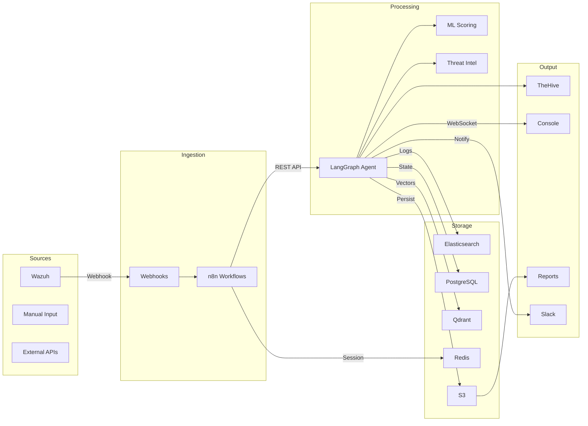

# Data Architecture

## Data Models

### AlertPayload

Raw alert received from Wazuh via n8n webhook.

```python
from pydantic import BaseModel, Field
from typing import Literal

class AlertPayload(BaseModel):
    alert_id: str = Field(min_length=1, max_length=128, description="Unique alert identifier")
    rule_id: str = Field(pattern=r"^\d{4,6}$", description="Wazuh rule ID")
    rule_level: int = Field(ge=1, le=15, description="Alert severity level (1-15)")
    rule_description: str = Field(max_length=512, description="Human-readable rule description")
    agent_id: str = Field(min_length=1, description="Wazuh agent identifier")
    agent_name: str = Field(min_length=1, description="Host name of the agent")
    source_ip: str = Field(description="Source IP address")
    destination_ip: str = Field(description="Destination IP address")
    source_port: int = Field(ge=1, le=65535, description="Source port number")
    destination_port: int = Field(ge=1, le=65535, description="Destination port number")
    protocol: Literal["tcp", "udp", "icmp", "other"] = Field(description="Network protocol")
    full_log: str = Field(max_length=65536, description="Full Wazuh alert log")
    timestamp: str = Field(description="Alert timestamp in ISO 8601 format")
```

### SOCAgentState

Core state object passed through the LangGraph agent workflow. Every node reads from and writes to this shared state.

```python
from typing import TypedDict, Literal
from pydantic import BaseModel

class SOCAgentState(TypedDict):
    # --- Input (immutable after ingestion) ---
    alert: dict                          # Raw AlertPayload as dict
    severity: Literal["P1","P2","P3","P4"]  # Priority level

    # --- Triage Output ---
    false_positive_probability: float    # 0.0-1.0, ML-scored FP likelihood
    mitre_techniques: list[str]          # ATT&CK technique IDs (e.g. ["T1059.001"])
    attack_narrative: str                # Human-readable kill-chain narrative

    # --- Analysis Output ---
    affected_assets: list[dict]          # Impacted hosts, users, IPs
    threat_actor_matches: list[dict]     # Threat actor profiles from OpenCTI
    ioc_enrichment: dict                 # Enriched IOC data from Cortex

    # --- Response Output ---
    response_actions: list[dict]         # Containment/isolation actions taken

    # --- Human Gate ---
    human_approved: bool | None          # True/False/None (timeout)
    approval_timeout: bool               # True if gate expired

    # --- Documentation ---
    incident_id: str                     # Generated UUID v4
    final_report: str                    # Markdown incident report
    messages: list[dict]                 # Full agent message history
```

**State Field Reference:**

| Field | Type | Required | Default | Mutated By | Description |
|-------|------|----------|---------|-----------|-------------|
| `alert` | `dict` | Yes | — | Input | Raw alert payload, immutable |
| `severity` | `str` | Yes | — | `triage` | Priority level P1-P4 |
| `false_positive_probability` | `float` | Yes | 0.5 | `triage`, `threat_intel` | FP probability score |
| `mitre_techniques` | `list[str]` | Yes | `[]` | `triage`, `analysis` | ATT&CK technique IDs |
| `attack_narrative` | `str` | Yes | `""` | `analysis` | Kill-chain narrative |
| `affected_assets` | `list[dict]` | Yes | `[]` | `analysis` | Asset impact list |
| `threat_actor_matches` | `list[dict]` | Yes | `[]` | `threat_intel` | Matched threat actors |
| `ioc_enrichment` | `dict` | Yes | `{}` | `threat_intel` | Enriched IOC data |
| `response_actions` | `list[dict]` | Yes | `[]` | `response`, `escalate` | Actions taken |
| `human_approved` | `bool \| None` | No | `None` | `human_gate` | Approval decision |
| `approval_timeout` | `bool` | No | `False` | `human_gate` | Timeout flag |
| `incident_id` | `str` | No | `""` | `documentation` | Incident UUID |
| `final_report` | `str` | No | `""` | `documentation` | Markdown report |
| `messages` | `list[dict]` | Yes | `[]` | All nodes | Agent message log |

### AgentResult

API response returned by `POST /agent/analyze`.

```python
class AgentResult(BaseModel):
    run_id: str = Field(description="Unique execution identifier")
    status: Literal["queued", "running", "completed", "failed"]
    incident_id: str | None = Field(default=None, description="Generated incident ID")
    severity: str | None = Field(default=None, description="Assigned severity")
    false_positive_probability: float | None = Field(default=None)
    final_report: str | None = Field(default=None, description="Markdown report")
    execution_time_ms: int = Field(description="Total execution time in milliseconds")
    nodes_executed: list[str] = Field(description="List of nodes that ran")
    error: str | None = Field(default=None, description="Error message if failed")
```

### SLA Definitions

Priority-based SLA thresholds for incident handling.

| Priority | Description | Response Time | Containment Time | Resolution Time |
|----------|-------------|---------------|-------------------|-----------------|
| P1 | Critical — active breach | ≤ 15 min | ≤ 30 min | ≤ 4 hours |
| P2 | High — confirmed malicious | ≤ 30 min | ≤ 1 hour | ≤ 8 hours |
| P3 | Medium — suspicious activity | ≤ 2 hours | ≤ 4 hours | ≤ 24 hours |
| P4 | Low — informational | ≤ 8 hours | ≤ 24 hours | ≤ 72 hours |

### Scheduling Models

```python
from typing import Literal

class Analyst(BaseModel):
    id: str = Field(description="Unique analyst identifier")
    name: str = Field(description="Full name")
    role: Literal["junior", "senior", "lead"] = Field(description="Role level")
    shift: Literal["DAY", "EVENING", "NIGHT"] = Field(description="Assigned shift")
    expertise: list[str] = Field(description="MITRE tactic specializations")
    max_concurrent_incidents: int = Field(description="Max active incidents")
    is_on_call: bool = Field(default=False, description="On-call status")
    pagerduty_id: str = Field(description="PagerDuty user ID")

class Shift(BaseModel):
    name: Literal["DAY", "EVENING", "NIGHT"] = Field(description="Shift identifier")
    start_hour: int = Field(ge=0, le=23, description="Start hour UTC")
    end_hour: int = Field(ge=0, le=23, description="End hour UTC")
    analysts: list[str] = Field(description="Assigned analyst IDs")
    shift_lead: str = Field(description="Shift lead analyst ID")

class AssignmentRule(BaseModel):
    id: str = Field(description="Rule identifier")
    name: str = Field(description="Human-readable rule name")
    priority_condition: Literal["P1", "P2", "P3", "P4"] | None = Field(
        default=None, description="Match on severity"
    )
    expertise_condition: list[str] = Field(
        default=[], description="Required MITRE tactic expertise"
    )
    assignment_type: Literal["round_robin", "least_loaded", "expertise_match"] = Field(
        description="Assignment strategy"
    )
    target_role: Literal["junior", "senior", "lead"] = Field(
        description="Minimum role for assignment"
    )
```

### Reporting Models

```python
class AlertMetrics(BaseModel):
    total_alerts: int = Field(description="Total alerts in period")
    true_positives: int = Field(description="Confirmed malicious alerts")
    false_positives: int = Field(description="Dismissed false alerts")
    fp_rate: float = Field(description="False positive rate (0.0-1.0)")
    tp_rate: float = Field(description="True positive rate (0.0-1.0)")
    by_severity: dict[str, int] = Field(description="Alert count by severity")
    by_mitre_tactic: dict[str, int] = Field(description="Alert count by MITRE tactic")
    avg_fp_probability: float = Field(description="Mean FP probability score")

class CaseMetrics(BaseModel):
    total_cases: int = Field(description="Total incidents in period")
    mttr: float = Field(description="Mean Time to Respond (minutes)")
    mttc: float = Field(description="Mean Time to Contain (minutes)")
    mttr_resolution: float = Field(description="Mean Time to Resolve (minutes)")
    by_severity: dict[str, int] = Field(description="Case count by severity")
    sla_breaches: dict[str, int] = Field(description="SLA breaches by severity")
    escalations: int = Field(description="Total escalations")

class WeeklySummary(BaseModel):
    period_start: str = Field(description="ISO 8601 period start")
    period_end: str = Field(description="ISO 8601 period end")
    alert_metrics: AlertMetrics = Field(description="Alert statistics")
    case_metrics: CaseMetrics = Field(description="Case statistics")
    agent_accuracy: float = Field(description="Agent triage accuracy (0.0-1.0)")
    top_mitre_techniques: list[dict] = Field(description="Top 10 techniques observed")
    threat_actor_activity: list[dict] = Field(description="Active threat actors")
    recommendations: list[str] = Field(description="Proactive recommendations")
```

## Data Flow



### Data Flow Stages

| Stage | Input | Processing | Output |
|-------|-------|-----------|--------|
| **Source** | Wazuh alerts, manual analyst input, external API data | — | Raw alert payloads |
| **Ingestion** | Raw payloads | HMAC verification, schema validation, deduplication | Validated AlertPayload |
| **Storage** | Validated payloads | Persistence to Elasticsearch, embedding generation for Qdrant | Indexed documents |
| **Processing** | Stored alerts | LangGraph agent execution, ML scoring, threat intel correlation | SOCAgentState |
| **Output** | Agent results | Case creation, report generation, notification dispatch | Incidents, reports, notifications |

## Storage Technologies

| Store | Purpose | Data Type | Access Pattern |
|-------|---------|-----------|----------------|
| Elasticsearch | Log storage, alert indexing, audit trail | Structured JSON | Search, aggregation, time-series queries |
| Qdrant | Vector embeddings, MITRE knowledge base | Float vectors + metadata | Similarity search, nearest-neighbor |
| PostgreSQL | Agent state checkpoints, incident metadata, scheduling | Relational | CRUD, joins, transactions |
| Redis | Session cache, rate limit counters, real-time state | Key-value | High-frequency reads, TTL expiration |
| S3 | Report archival, raw log backups, cold storage | Binary files | Write-once, infrequent reads |

### Storage Mapping

| Data Type | Primary Store | Backup | Archive | Retention |
|-----------|--------------|--------|---------|-----------|
| Raw Wazuh logs | Elasticsearch | S3 (daily snapshot) | S3-IA (7yr) | 90d hot / 1yr warm / 7yr cold |
| Alert documents | Elasticsearch | PostgreSQL | S3-IA (10yr) | Permanent |
| Agent state | PostgreSQL | — | — | 2 years |
| Incident cases | PostgreSQL (via TheHive) | S3 | S3-IA (10yr) | 10 years |
| Vector embeddings | Qdrant | — | — | 1 year |
| Agent audit logs | Elasticsearch | S3 (daily snapshot) | S3-IA (7yr) | 1 year hot / 7yr cold |
| Vault audit logs | File (local) | S3 | S3-IA (7yr) | 90d local / 7yr S3 |
| Reports (PDF/HTML) | S3 | — | S3-IA (7yr) | 1 year standard / 7yr cold |
| Session data | Redis | — | — | 24 hours |
| MITRE knowledge base | Qdrant | Elasticsearch | — | Updated on ATT&CK releases |
| Configuration | K8s ConfigMaps/Secrets | Git (private repo) | — | Permanent |

## Data Retention

| Data Category | Hot | Warm | Cold | Deletion |
|---------------|-----|------|------|----------|
| Raw logs | 90 days (Elasticsearch) | 1 year (S3-Standard) | 7 years (S3-IA) | Permanent deletion after 7 years |
| Alert data | Permanent (Elasticsearch) | — | — | Never deleted |
| Incident cases | 2 years (PostgreSQL) | 5 years (S3-Standard) | 10 years (S3-IA) | Permanent deletion after 10 years |
| Agent audit logs | 1 year (Elasticsearch) | 7 years (S3-IA) | — | Permanent deletion after 7 years |
| Vault audit logs | 90 days (local file) | 7 years (S3-IA) | — | Permanent deletion after 7 years |
| Vector embeddings | 1 year (Qdrant) | — | — | Re-indexed on ATT&CK updates |
| Session data | 24 hours (Redis) | — | — | TTL auto-expiry |
| Reports | 1 year (S3-Standard) | 7 years (S3-IA) | — | Permanent deletion after 7 years |
| Backup data | — | 30 days (S3-Standard) | — | Auto-expiry policy |

### Retention Enforcement

- **Elasticsearch:** Index Lifecycle Management (ILM) policies auto-transition indices through hot → warm → cold → delete phases.
- **S3:** Lifecycle policies transition objects between storage classes and enforce expiration.
- **PostgreSQL:** pg_partman for table partitioning with automated partition detachment and drop.
- **Redis:** TTL-based expiration with `maxmemory-policy: allkeys-lru`.
- **Qdrant:** Collection-level TTL with compaction jobs.

## Data Classification

| Classification | Description | Examples | Controls |
|----------------|-------------|----------|----------|
| **Public** | Non-sensitive, publicly available data | MITRE ATT&CK knowledge base, public threat reports | No restrictions |
| **Internal** | Business data not intended for public release | Alert counts, MTTR metrics, shift schedules | Authentication required, no external sharing |
| **Confidential** | Sensitive operational data | Full alert payloads, IOCs, incident details, agent logic | Encryption at rest + in transit, role-based access, audit logging |
| **Restricted** | Highly sensitive data requiring strictest controls | Customer PII, API keys, Vault secrets, HMAC keys | Encryption at rest + in transit, MFA, break-glass access, DLP scanning, audit trail |

### Classification Application

| Data Element | Classification | Reasoning |
|-------------|---------------|-----------|
| MITRE technique descriptions | Public | Open-source knowledge |
| Alert count dashboards | Internal | Business metrics |
| Raw alert payloads | Confidential | Contains network indicators, host details |
| Incident reports | Confidential | Operational security data |
| Customer PII (if present in alerts) | Restricted | Regulatory requirements |
| API keys and tokens | Restricted | Credential material |
| HMAC signing secrets | Restricted | Integrity verification keys |
| Vault unseal keys | Restricted | Platform root of trust |
| Agent system prompts | Confidential | Proprietary AI logic |
| Audit logs | Confidential | Security evidence |
| SLA breach notifications | Internal | Operational metrics |
| Threat actor profiles | Confidential | Threat intelligence |
