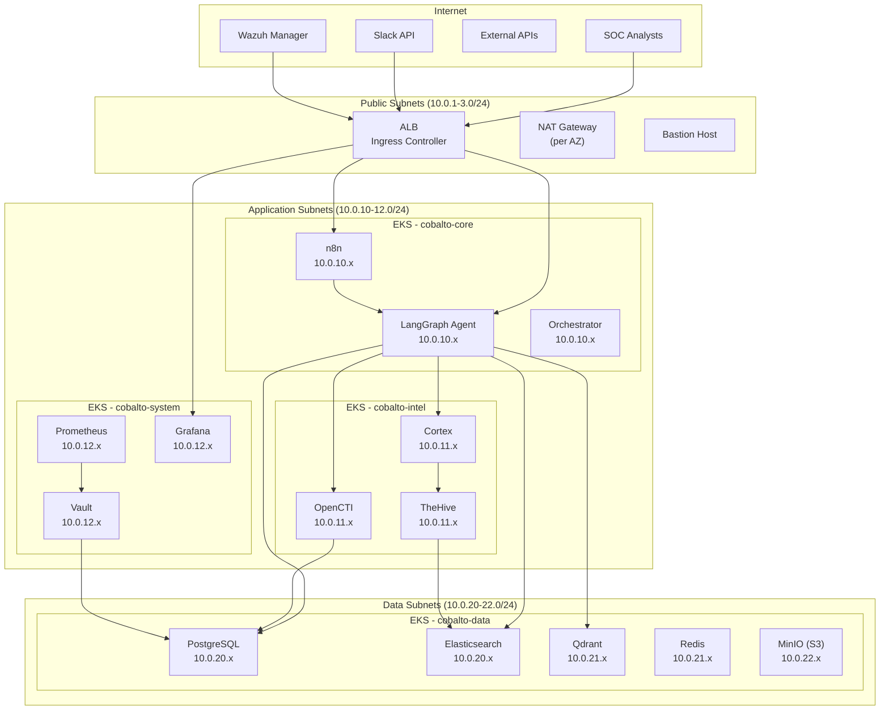

# Network Topology

## Overview

The Cobalto SOC platform runs on AWS EKS within a VPC designed for security isolation, with distinct network tiers for public, application, and data workloads.

## VPC Design

```
VPC: 10.0.0.0/16 (65,536 IPs)
├── Public Subnets
│   ├── 10.0.1.0/24   (us-east-1a)  — ALB, NAT Gateway, Bastion
│   ├── 10.0.2.0/24   (us-east-1b)  — ALB, NAT Gateway
│   └── 10.0.3.0/24   (us-east-1c)  — ALB, NAT Gateway
├── Application Subnets
│   ├── 10.0.10.0/24  (us-east-1a)  — EKS worker nodes (app)
│   ├── 10.0.11.0/24  (us-east-1b)  — EKS worker nodes (app)
│   └── 10.0.12.0/24  (us-east-1c)  — EKS worker nodes (app)
└── Data Subnets
    ├── 10.0.20.0/24  (us-east-1a)  — EKS worker nodes (data)
    ├── 10.0.21.0/24  (us-east-1b)  — EKS worker nodes (data)
    └── 10.0.22.0/24  (us-east-1c)  — EKS worker nodes (data)
```

## Network Architecture Diagram



## Security Groups

### ALB Security Group (`sg-alb`)

| Direction | Protocol | Port  | Source/Destination      | Purpose           |
|-----------|----------|-------|-------------------------|--------------------|
| Inbound   | TCP      | 443   | 0.0.0.0/0              | HTTPS from internet |
| Inbound   | TCP      | 80    | 0.0.0.0/0              | HTTP redirect      |
| Outbound  | TCP      | 8080  | sg-app-nodes           | To application pods |
| Outbound  | TCP      | 3000  | sg-app-nodes           | To Grafana         |

### Application Node SG (`sg-app-nodes`)

| Direction | Protocol | Port      | Source/Destination  | Purpose                   |
|-----------|----------|-----------|---------------------|---------------------------|
| Inbound   | TCP      | 8080      | sg-alb              | From ALB                  |
| Inbound   | TCP      | 10250     | sg-control-plane    | Kubelet                   |
| Inbound   | TCP      | 443       | sg-control-plane    | API server                |
| Inbound   | TCP/UDP  | 30000-32767| sg-alb              | NodePort services         |
| Outbound  | TCP      | 443       | 0.0.0.0/0           | External APIs             |
| Outbound  | TCP      | 5432      | sg-data-nodes       | PostgreSQL                |
| Outbound  | TCP      | 9200      | sg-data-nodes       | Elasticsearch             |
| Outbound  | TCP      | 6333      | sg-data-nodes       | Qdrant                    |
| Outbound  | TCP      | 6379      | sg-data-nodes       | Redis                     |
| Outbound  | TCP      | 8200      | sg-system-nodes     | Vault                     |
| Outbound  | TCP      | 53        | 0.0.0.0/0           | DNS                       |
| Outbound  | UDP      | 53        | 0.0.0.0/0           | DNS                       |

### Data Node SG (`sg-data-nodes`)

| Direction | Protocol | Port      | Source/Destination    | Purpose                 |
|-----------|----------|-----------|----------------------|-------------------------|
| Inbound   | TCP      | 5432      | sg-app-nodes         | PostgreSQL              |
| Inbound   | TCP      | 9200      | sg-app-nodes         | Elasticsearch           |
| Inbound   | TCP      | 9300      | sg-data-nodes        | ES cluster discovery    |
| Inbound   | TCP      | 6333      | sg-app-nodes         | Qdrant                  |
| Inbound   | TCP      | 6379      | sg-app-nodes         | Redis                   |
| Inbound   | TCP      | 9000      | sg-data-nodes        | MinIO                   |
| Inbound   | TCP      | 10250     | sg-control-plane     | Kubelet                 |
| Outbound  | TCP      | 53        | 0.0.0.0/0            | DNS                     |

## Kubernetes Network Policies

### Default Deny All (all namespaces)

```yaml
apiVersion: networking.k8s.io/v1
kind: NetworkPolicy
metadata:
  name: default-deny-all
spec:
  podSelector: {}
  policyTypes:
    - Ingress
    - Egress
```

### DNS Allow (all namespaces)

```yaml
apiVersion: networking.k8s.io/v1
kind: NetworkPolicy
metadata:
  name: allow-dns
spec:
  podSelector: {}
  policyTypes:
    - Egress
  egress:
    - to:
        - namespaceSelector: {}
      ports:
        - protocol: UDP
          port: 53
        - protocol: TCP
          port: 53
```

### n8n → LangGraph

```yaml
apiVersion: networking.k8s.io/v1
kind: NetworkPolicy
metadata:
  name: n8n-to-langgraph
  namespace: cobalto-core
spec:
  podSelector:
    matchLabels:
      app: n8n
  policyTypes:
    - Egress
  egress:
    - to:
        - podSelector:
            matchLabels:
              app: langgraph-agent
      ports:
        - protocol: TCP
          port: 8080
```

### LangGraph → Data Stores

```yaml
apiVersion: networking.k8s.io/v1
kind: NetworkPolicy
metadata:
  name: langgraph-to-data
  namespace: cobalto-core
spec:
  podSelector:
    matchLabels:
      app: langgraph-agent
  policyTypes:
    - Egress
  egress:
    - to:
        - podSelector:
            matchLabels:
              app: qdrant
      ports:
        - protocol: TCP
          port: 6333
    - to:
        - podSelector:
            matchLabels:
              app: elasticsearch
      ports:
        - protocol: TCP
          port: 9200
    - to:
        - podSelector:
            matchLabels:
              app: postgresql
      ports:
        - protocol: TCP
          port: 5432
    - to:
        - podSelector:
            matchLabels:
              app: opencti
      ports:
        - protocol: TCP
          port: 4000
    - to:
        - podSelector:
            matchLabels:
              app: cortex
      ports:
        - protocol: TCP
          port: 9001
```

### LangGraph → Vault

```yaml
apiVersion: networking.k8s.io/v1
kind: NetworkPolicy
metadata:
  name: langgraph-to-vault
  namespace: cobalto-core
spec:
  podSelector:
    matchLabels:
      app: langgraph-agent
  policyTypes:
    - Egress
  egress:
    - to:
        - podSelector:
            matchLabels:
              app: vault
              namespace: cobalto-system
      ports:
        - protocol: TCP
          port: 8200
```

## VPC Endpoints

| Service              | Type     | Endpoint                              | Purpose                        |
|----------------------|----------|---------------------------------------|--------------------------------|
| S3                   | Gateway  | `vpce-xxx.s3.us-east-1.amazonaws.com`| Object storage access          |
| ECR (Docker)         | Interface| `vpce-xxx.ecr.us-east-1.amazonaws.com` | Container image pulls     |
| ECR (DKR)            | Interface| `vpce-xxx.ecr.us-east-1.amazonaws.com` | Container registry API   |
| CloudWatch Logs      | Interface| `vpce-xxx.logs.us-east-1.amazonaws.com` | Log shipping             |
| KMS                  | Interface| `vpce-xxx.kms.us-east-1.amazonaws.com` | Encryption key management |
| STS                  | Interface| `vpce-xxx.sts.us-east-1.amazonaws.com` | IAM role assumption       |
| Secrets Manager      | Interface| `vpce-xxx.secretsmanager.us-east-1.amazonaws.com` | Secret retrieval |

## TLS Configuration

### Internal Service Communication (mTLS)

All internal service-to-service communication uses mutual TLS:

- **Certificate Authority**: Vault PKI engine (`pca/`)
- **Certificate Lifetime**: 24 hours (auto-rotation)
- **Minimum TLS Version**: TLS 1.3
- **Cipher Suites**: `TLS_AES_256_GCM_SHA384`, `TLS_CHACHA20_POLY1305_SHA256`
- **Service Identity**: SPIFFE IDs (`spiffe://cobalto.internal/ns/{namespace}/sa/{service}`)

### External Traffic (TLS)

- **TLS Termination**: At ALB (AWS Certificate Manager)
- **Minimum TLS Version**: TLS 1.2
- **Certificate**: ACM-managed, auto-renewed
- **HSTS**: Enabled, `max-age=31536000`

### Certificate Flow

```
Vault PKI ──issues cert──▶ Service A ──mTLS──▶ Service B
    │                         │                    │
    ├── Root CA               ├── spiffe://...     ├── Validates
    ├── Intermediate CA       ├── 24h lifetime     ├── Uses CA bundle
    └── Auto-renewal          └── Auto-renewal     └── No plaintext
```
