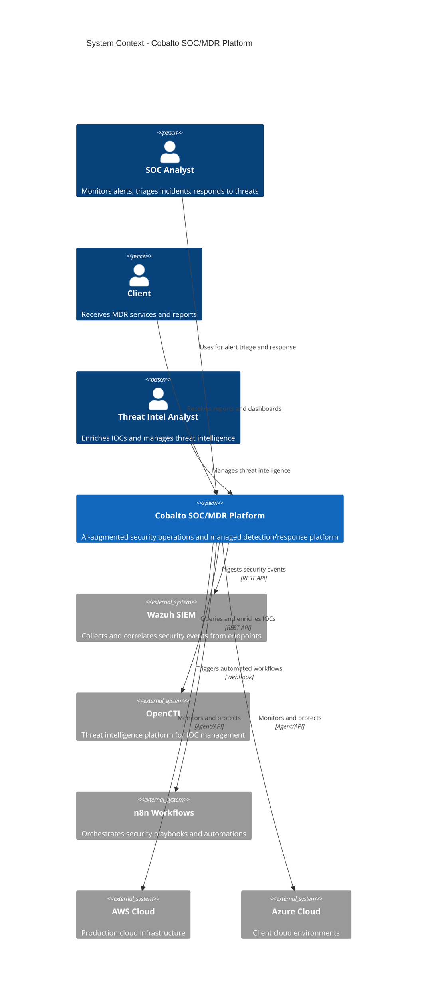
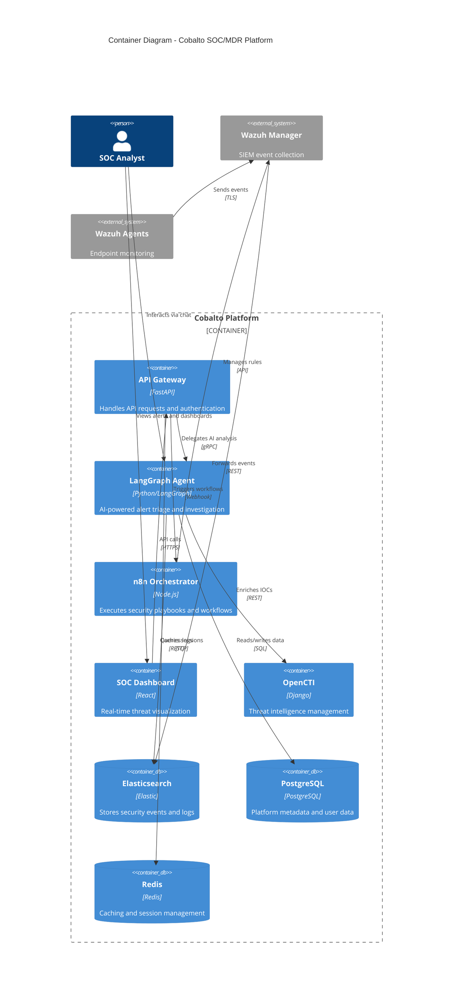

# Architecture Overview

## System Context



## Container Diagram



## Four-Layer Architecture

The platform follows a four-layer architecture pattern for separation of concerns:

### Layer 1: Data Collection

Responsible for ingesting security telemetry from multiple sources.

| Component | Purpose | Protocol |
|-----------|---------|----------|
| Wazuh Agents | Endpoint monitoring (file integrity, rootkit detection, vulnerability scanning) | TLS |
| Wazuh Manager | Event correlation and rule-based alerting | REST API |
| Custom Collectors | Cloud provider logs, network flow data, DNS logs | SDK/Webhook |

**Data Sources:**
- Windows/Linux/macOS endpoints
- CloudTrail, VPC Flow Logs, GuardDuty
- Network devices (firewalls, switches)
- DNS servers, proxies, email gateways

### Layer 2: Analysis & Intelligence

AI-powered analysis and threat intelligence enrichment.

| Component | Purpose | Technology |
|-----------|---------|------------|
| LangGraph Agent | AI-powered alert triage, investigation orchestration | Python, LangGraph, LLMs |
| OpenCTI | Threat intelligence management and IOC enrichment | Django, GraphQL |
| Elasticsearch | Log aggregation and full-text search | Elastic Stack |

**Capabilities:**
- Automated alert triage using LLM reasoning
- IOC enrichment against threat intelligence feeds
- Behavioral analysis and anomaly detection
- Correlation across multiple data sources

### Layer 3: Orchestration & Response

Automated response and playbook execution.

| Component | Purpose | Technology |
|-----------|---------|------------|
| n8n | Workflow orchestration and automation | Node.js |
| API Gateway | Centralized request routing and auth | FastAPI |
| Response Actions | Isolate host, block IP, disable user | Wazuh API |

**Automated Playbooks:**
- Phishing response (email analysis, URL detonation, user notification)
- Malware containment (host isolation, IOC extraction, threat hunting)
- Brute force response (account lockout, IP blocking, investigation)
- Vulnerability management (patch deployment, compliance check)

### Layer 4: Presentation & Reporting

User interfaces and reporting dashboards.

| Component | Purpose | Technology |
|-----------|---------|------------|
| SOC Dashboard | Real-time alert visualization and case management | React |
| Reports | SLA compliance, threat landscape, executive summaries | PDF/HTML |
| API | Programmatic access for integrations | REST/GraphQL |

**Dashboard Features:**
- Real-time alert feed with severity filtering
- Case management with assignment tracking
- Threat landscape visualization
- MDT (Mean Detection Time) and MTTA (Mean Time to Acknowledge) metrics

## Component Stack

| Layer | Component | Technology | Version | Purpose |
|-------|-----------|------------|---------|---------|
| **Orchestration** | Kubernetes | EKS | 1.28 | Container orchestration |
| | Flux CD | Flux | 2.2 | GitOps continuous delivery |
| | Kustomize | Kustomize | 5.4 | Manifest management |
| **Data** | PostgreSQL | PostgreSQL | 16 | Primary database |
| | Elasticsearch | Elasticsearch | 8.12 | Log storage and search |
| | Redis | Redis | 7.2 | Caching and queuing |
| **Application** | LangGraph Agent | Python | 3.11 | AI agent framework |
| | n8n | Node.js | 1.28 | Workflow automation |
| | OpenCTI | Django | 5.0 | Threat intelligence |
| | API Gateway | FastAPI | 0.109 | REST API |
| | Dashboard | React | 18 | Web UI |
| **Security** | Wazuh | Wazuh | 4.7 | SIEM and XDR |
| | Trivy | Trivy | 0.49 | Container scanning |
| | Bandit | Bandit | 1.7 | Python SAST |
| **Infrastructure** | Terraform | Terraform | 1.7 | IaC provisioning |
| | AWS EKS | AWS | - | Managed Kubernetes |
| | AWS ECR | AWS | - | Container registry |

## Data Flow

```
┌─────────────────────────────────────────────────────────────────┐
│                        DATA FLOW                                │
├─────────────────────────────────────────────────────────────────┤
│                                                                 │
│  1. COLLECTION                                                  │
│     Wazuh Agents ──► Wazuh Manager ──► Elasticsearch            │
│     Cloud APIs ────► Custom Collectors ──► Elasticsearch         │
│                                                                 │
│  2. DETECTION                                                   │
│     Elasticsearch ──► Wazuh Rules ──► Alerts                     │
│     Alerts ────────► LangGraph Agent ──► Enriched Events         │
│                                                                 │
│  3. ENRICHMENT                                                  │
│     LangGraph ──────► OpenCTI ──► IOC Context                    │
│     LangGraph ──────► OSINT APIs ──► Threat Context              │
│                                                                 │
│  4. ORCHESTRATION                                               │
│     Enriched Events ──► n8n ──► Playbook Execution               │
│     n8n ────────────► Wazuh API ──► Response Actions             │
│     n8n ────────────► Cloud APIs ──► Cloud Response               │
│                                                                 │
│  5. PRESENTATION                                                │
│     API ────────────► Dashboard ──► SOC Analyst                  │
│     API ────────────► Reports ──► Client                         │
│                                                                 │
└─────────────────────────────────────────────────────────────────┘
```

### Data Flow Stages

1. **Collection**: Agents and collectors gather telemetry from endpoints, cloud environments, and network devices, forwarding events to Elasticsearch via the Wazuh manager.

2. **Detection**: Wazuh correlation rules generate alerts from raw events. The LangGraph AI agent receives high-fidelity alerts for intelligent triage and investigation.

3. **Enrichment**: The AI agent queries OpenCTI for IOC reputation, threat actor profiles, and campaign context. OSINT sources provide additional context.

4. **Orchestration**: Enriched events trigger n8n workflows that execute response playbooks: host isolation, IP blocking, account disablement, and notification sequences.

5. **Presentation**: The API gateway serves real-time data to the SOC dashboard for analyst review and generates reports for client delivery.
