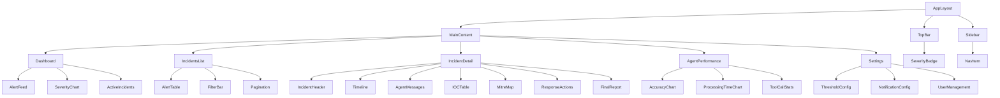

# Cobalt Console Architecture

## Tech Stack

| Layer | Technology | Version |
|-------|-----------|---------|
| Framework | Next.js | 14 (App Router) |
| UI Library | React | 18 |
| Language | TypeScript | 5.x |
| Styling | Tailwind CSS | 3.x |
| State | Zustand | 4.x |
| Charts | Recharts | 2.x |
| Tables | TanStack Table | 8.x |
| Auth | NextAuth.js | 5.x |
| HTTP Client | Axios | 1.x |
| Real-time | Socket.io Client | 4.x |

**Theme:** Dark mode enforced globally via `next-themes` with `class` strategy. No light mode toggle — the console is designed for SOC analysts working in dim SOC environments.

## Pages

| Route | Component | Description |
|-------|-----------|-------------|
| `/` | `Dashboard` | Real-time alert feed, severity distribution chart, active incidents count, agent performance KPIs |
| `/incidents` | `IncidentsList` | Filterable/sortable incident table with status, severity, assignee, and MTTR columns |
| `/incidents/[id]` | `IncidentDetail` | Full incident view: timeline, agent messages, IOCs, MITRE mapping, response actions, report |
| `/agents` | `AgentPerformance` | Per-agent metrics: accuracy, FP rate, avg processing time, tool call success rates |
| `/settings` | `Settings` | Threshold tuning, notification config, user management, API key management |

### Page Map

```
/                          → Dashboard
├── /incidents             → Incidents List
│   └── /incidents/[id]    → Incident Detail
├── /agents                → Agent Performance
└── /settings              → Settings
    ├── /settings/notifications
    ├── /settings/thresholds
    └── /settings/users
```

## Components

### AlertTable

Data table component built on TanStack Table with server-side pagination.

- **Props:** `alerts: Alert[]`, `onRowClick: (id: string) => void`, `filters: AlertFilters`
- **Features:** Column sorting, severity filter dropdown, date range picker, CSV export
- **Columns:** Timestamp, Source, Severity, Rule ID, Source IP, Dest IP, Status, Assignee
- **Pagination:** Server-side via cursor-based API, 50 rows per page default

### SeverityBadge

Visual indicator for alert/incident severity.

- **Variants:** `P1` (red pulse animation), `P2` (orange), `P3` (yellow), `P4` (gray)
- **Props:** `severity: "P1" | "P2" | "P3" | "P4"`, `size?: "sm" | "md" | "lg"`
- **Behavior:** P1 badges animate with a subtle pulse to draw attention

### MitreTag

Displays MITRE ATT&CK technique IDs as clickable tags.

- **Props:** `techniques: string[]`, `onClick?: (technique: string) => void`
- **Behavior:** Clicking a tag opens a popover with technique name, description, and detection recommendations from the ATT&CK knowledge base
- **Color coding:** Each tactic has a distinct color (Initial Access = red, Execution = orange, etc.)

### ApprovalDialog

Modal dialog for human-in-the-loop approval of agent response actions.

- **Props:** `incidentId: string`, `actions: ResponseAction[]`, `timeout: number`
- **Features:** Countdown timer showing remaining approval window, action detail expand/collapse, approve/reject buttons, comment field for rejection reason
- **Timeout behavior:** Auto-rejects when timer reaches zero, plays a subtle alert sound

## Component Hierarchy



## API Integration

The console communicates with three backend services:

### LangGraph Agent Service

- **Base URL:** `http://langgraph-agent:8000`
- **Endpoints used:**
  - `POST /agent/analyze` — Trigger agent analysis for an alert
  - `GET /agent/status/{run_id}` — Poll agent execution status
  - `WS /agent/stream/{run_id}` — Real-time agent progress stream
  - `POST /agent/approve` — Submit human approval decision

### TheHive

- **Base URL:** `http://thehive:9000`
- **Endpoints used:**
  - `GET /api/case` — List cases with filtering
  - `GET /api/case/{id}` — Get case details
  - `GET /api/case/{id}/task` — List case tasks
  - `POST /api/alert/{id}/create_case` — Create case from alert

### n8n Workflows

- **Base URL:** `http://n8n:5678`
- **Endpoints used:**
  - `POST /webhook/alert` — Trigger alert ingestion workflow
  - `GET /webhook/status/{executionId}` — Check workflow execution status
  - `POST /webhook/escalate` — Trigger escalation workflow

### API Client Configuration

```typescript
// lib/api-client.ts
import axios from 'axios';

const apiClient = axios.create({
  baseURL: process.env.NEXT_PUBLIC_API_URL || 'http://langgraph-agent:8000',
  timeout: 30000,
  headers: {
    'Content-Type': 'application/json',
  },
});

apiClient.interceptors.request.use((config) => {
  const token = getSessionToken();
  if (token) config.headers.Authorization = `Bearer ${token}`;
  return config;
});

apiClient.interceptors.response.use(
  (response) => response,
  (error) => {
    if (error.response?.status === 429) {
      toast.error('Rate limit exceeded. Please wait.');
    }
    return Promise.reject(error);
  }
);
```

## Deployment

### Multi-Stage Docker Build

```dockerfile
# Stage 1: Build
FROM node:20-alpine AS builder
WORKDIR /app
COPY package*.json ./
RUN npm ci
COPY . .
RUN npm run build

# Stage 2: Serve
FROM nginx:alpine AS production
COPY --from=builder /app/.next/static /usr/share/nginx/html/_next/static
COPY --from=builder /app/public /usr/share/nginx/html/public
COPY nginx.conf /etc/nginx/conf.d/default.conf
EXPOSE 80
CMD ["nginx", "-g", "daemon off;"]
```

### Kubernetes Deployment

```yaml
apiVersion: apps/v1
kind: Deployment
metadata:
  name: cobalt-console
  namespace: cobalt
spec:
  replicas: 3
  selector:
    matchLabels:
      app: cobalt-console
  template:
    metadata:
      labels:
        app: cobalt-console
    spec:
      containers:
        - name: console
          image: ghcr.io/cobalto/console:latest
          ports:
            - containerPort: 80
          resources:
            requests:
              memory: "128Mi"
              cpu: "100m"
            limits:
              memory: "256Mi"
              cpu: "500m"
          livenessProbe:
            httpGet:
              path: /
              port: 80
            initialDelaySeconds: 10
            periodSeconds: 30
          readinessProbe:
            httpGet:
              path: /
              port: 80
            initialDelaySeconds: 5
            periodSeconds: 10
      affinity:
        podAntiAffinity:
          preferredDuringSchedulingIgnoredDuringExecution:
            - weight: 100
              podAffinityTerm:
                labelSelector:
                  matchLabels:
                    app: cobalt-console
                topologyKey: kubernetes.io/hostname
---
apiVersion: v1
kind: Service
metadata:
  name: cobalt-console
  namespace: cobalt
spec:
  selector:
    app: cobalt-console
  ports:
    - port: 80
      targetPort: 80
  type: ClusterIP
---
apiVersion: networking.k8s.io/v1
kind: Ingress
metadata:
  name: cobalt-console
  namespace: cobalt
  annotations:
    nginx.ingress.kubernetes.io/ssl-redirect: "true"
    nginx.ingress.kubernetes.io/proxy-body-size: "10m"
spec:
  ingressClassName: nginx
  tls:
    - hosts:
        - console.cobalto.internal
      secretName: cobalt-console-tls
  rules:
    - host: console.cobalto.internal
      http:
        paths:
          - path: /
            pathType: Prefix
            backend:
              service:
                name: cobalt-console
                port:
                  number: 80
```
