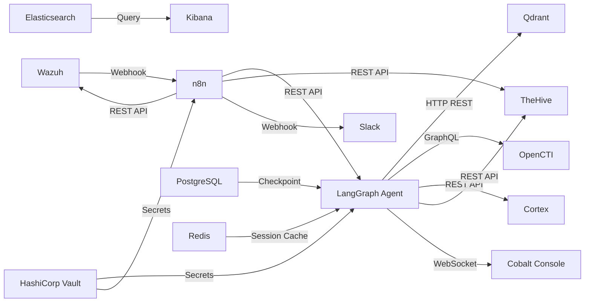
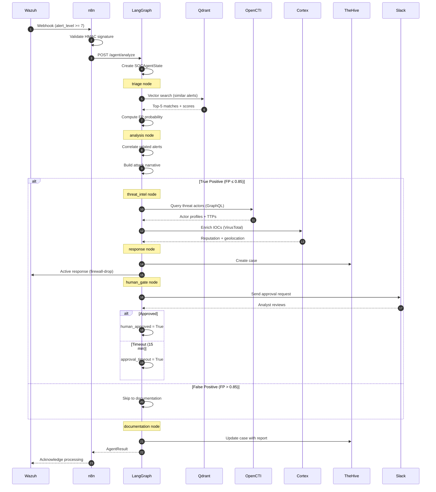
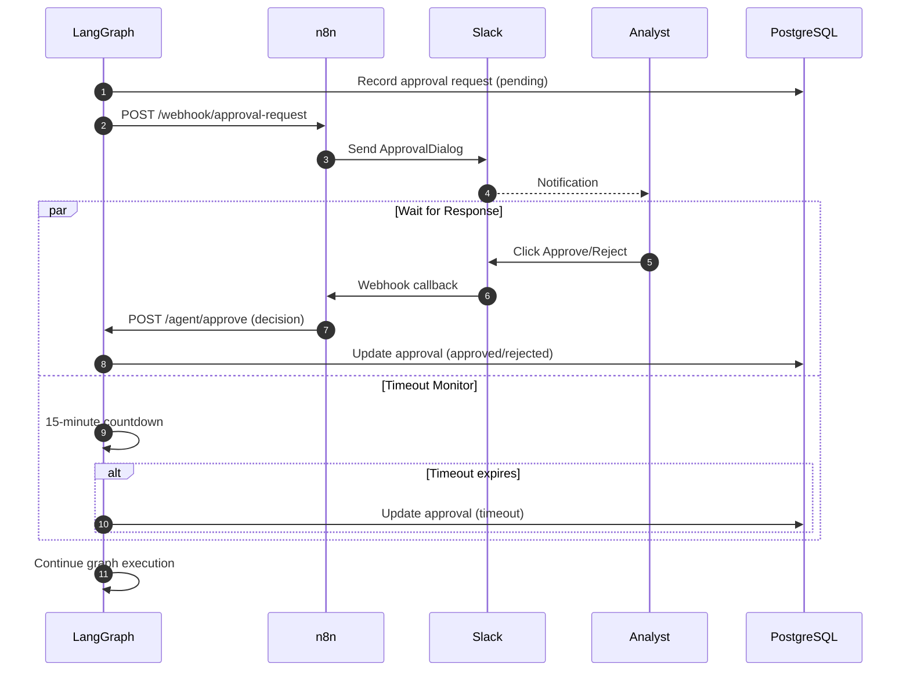

# Service Integration Patterns

## Communication Protocols

The Cobalto platform uses five distinct communication protocols depending on the integration requirements:

| Protocol | Use Case | Services |
|----------|----------|----------|
| HTTP REST | Synchronous request-response | n8n ↔ LangGraph, LangGraph ↔ Cortex, n8n ↔ TheHive |
| GraphQL | Flexible data queries with nested resources | LangGraph ↔ OpenCTI |
| gRPC | High-throughput binary communication (optional) | LangGraph ↔ Qdrant (alternative to REST) |
| Webhooks | Event-driven push notifications | Wazuh → n8n, n8n → Slack |
| Event Streams | Real-time log/event streaming | Elasticsearch → Kibana, Wazuh → Elasticsearch |

## Service Mesh

All inter-service communication within the Kubernetes cluster is managed by **Istio** service mesh.

### mTLS

- **Mode:** STRICT — all service-to-service communication is encrypted
- **Certificate rotation:** Automatic via Istio Citadel, 24-hour lifetime
- **Verification:** SPIFFE identity verified on every connection

### Traffic Management

- **Circuit breaking:** Max 10 connections, 30s timeout, 5 consecutive errors triggers open circuit
- **Retry policy:** 3 retries with exponential backoff (250ms, 500ms, 1s)
- **Load balancing:** Round-robin with locality-aware failover
- **Canary deployments:** 10% traffic shift over 10 minutes for new versions

### Observability

- **Distributed tracing:** Jaeger with OpenTelemetry SDK, 1% sampling rate for normal traffic, 100% for P1 alerts
- **Metrics:** Prometheus scrape endpoints on all services, custom dashboards in Grafana
- **Access logs:** Istio proxy access logs shipped to Elasticsearch

## Integration Map



### Service Communication Table

| Source | Destination | Protocol | Auth | Payload | SLA |
|--------|-------------|----------|------|---------|-----|
| Wazuh | n8n | Webhook (HTTPS) | HMAC signature | JSON alert | < 1s |
| n8n | LangGraph | REST (POST) | Bearer token | Alert payload | < 2s |
| n8n | TheHive | REST (API key) | X-API-Key header | Case/alert JSON | < 3s |
| n8n | Slack | Webhook (HTTPS) | Webhook URL | Block Kit JSON | < 1s |
| n8n | Wazuh | REST (API key) | Authorization header | Active response cmd | < 2s |
| LangGraph | Qdrant | HTTP REST | API key | Vector query | < 500ms |
| LangGraph | OpenCTI | GraphQL | Bearer token | STIX query | < 5s |
| LangGraph | Cortex | REST | Bearer token | IOC data | < 10s |
| LangGraph | TheHive | REST (API key) | X-API-Key header | Case JSON | < 3s |
| LangGraph | Console | WebSocket | JWT | State stream | Real-time |

## Detailed Integration Specifications

### Wazuh → n8n: Webhook

```json
{
  "endpoint": "https://n8n.cobalto.internal/webhook/wazuh-alert",
  "method": "POST",
  "headers": {
    "Content-Type": "application/json",
    "X-Wazuh-Signature": "<hmac-sha256>"
  },
  "payload": {
    "alert_id": "string",
    "timestamp": "ISO 8601",
    "rule_id": "integer",
    "rule_level": "integer (1-15)",
    "rule_description": "string",
    "agent_id": "string",
    "agent_name": "string",
    "agent_ip": "string",
    "source_ip": "string",
    "destination_ip": "string",
    "source_port": "integer",
    "destination_port": "integer",
    "protocol": "string",
    "action": "string",
    "full_log": "string"
  },
  "filter": "alert_level >= 7",
  "retry": {
    "max_retries": 3,
    "backoff_ms": [1000, 2000, 4000]
  }
}
```

**HMAC Verification:**
```python
import hmac, hashlib

def verify_wazuh_signature(payload: bytes, signature: str, secret: str) -> bool:
    expected = hmac.new(secret.encode(), payload, hashlib.sha256).hexdigest()
    return hmac.compare_digest(expected, signature)
```

### n8n → LangGraph: REST API

```json
{
  "endpoint": "http://langgraph-agent:8000/agent/analyze",
  "method": "POST",
  "headers": {
    "Content-Type": "application/json",
    "Authorization": "Bearer <jwt-token>",
    "X-Request-ID": "<uuid>"
  },
  "payload": {
    "alert": {
      "alert_id": "string",
      "rule_id": "string",
      "rule_level": "integer",
      "agent_name": "string",
      "source_ip": "string",
      "destination_ip": "string",
      "source_port": "integer",
      "destination_port": "integer",
      "protocol": "string",
      "full_log": "string"
    },
    "customer_id": "string",
    "priority_override": "P1|P2|P3|P4|null"
  },
  "response": {
    "run_id": "uuid",
    "status": "queued|running|completed|failed",
    "result": "SOCAgentState (when completed)"
  }
}
```

### LangGraph → Qdrant: Vector Search

```json
{
  "endpoint": "http://qdrant:6333/collections/mitre_techniques/points/search",
  "method": "POST",
  "auth": "api-key header",
  "payload": {
    "vector": "<embedding-float-array>",
    "limit": 5,
    "with_payload": true,
    "score_threshold": 0.7
  },
  "response": {
    "result": [
      {
        "id": "uuid",
        "payload": {
          "technique_id": "T1059.001",
          "name": "PowerShell",
          "description": "...",
          "tactic": "Execution",
          "platforms": ["Windows"],
          "detection": "..."
        },
        "score": 0.92
      }
    ]
  }
}
```

**gRPC Alternative:**
```protobuf
service Points {
  rpc Search (SearchPoints) returns (SearchResponse);
  rpc Upsert (UpsertPoints) returns (PointsOperationResponse);
}

message SearchPoints {
  repeated float vector = 1;
  uint32 limit = 2;
  float score_threshold = 3;
}
```

### LangGraph → OpenCTI: GraphQL

```graphql
query ThreatActorLookup($techniques: [String!]!) {
  threatActors(
    filter: {
      or: [
        { techniques: { contains: $techniques } }
      ]
    }
  ) {
    edges {
      node {
        id
        name
        description
        firstSeen
        lastSeen
        aliases
        threatActorTypes
        countries
        goals
        sophistication
        techniques {
          id
          name
          mitreId
        }
      }
    }
  }
}

query IOCLookup($pattern: String!) {
  indicators(
    filter: {
      pattern: { eq: $pattern }
    }
  ) {
    edges {
      node {
        id
        name
        pattern
        patternType
        validFrom
        validUntil
        createdBy { name }
        objectLabel { value }
      }
    }
  }
}
```

**Authentication:** Bearer token from Vault dynamic secrets engine, rotated every 1 hour.

### LangGraph → Cortex: IOC Enrichment

```json
{
  "endpoint": "http://cortex:9001/api/analyzer/run",
  "method": "POST",
  "headers": {
    "Authorization": "Bearer <cortex-api-key>",
    "Content-Type": "application/json"
  },
  "payload": {
    "analyzer": "VirusTotal_V3",
    "dataType": "ip",
    "data": "203.0.113.42",
    "options": {
      "timeout": 30,
      "forceRefresh": false
    }
  },
  "polling": {
    "status_endpoint": "http://cortex:9001/api/job/{job_id}",
    "interval_ms": 2000,
    "max_polls": 15
  },
  "response": {
    "report": {
      "data": {
        "attributes": {
          "last_analysis_stats": {
            "malicious": 12,
            "suspicious": 3,
            "harmless": 60,
            "undetected": 5
          },
          "reputation": -50,
          "asn": "AS15169",
          "country": "US"
        }
      }
    }
  }
}
```

### n8n → TheHive: Case Management

```json
{
  "create_case": {
    "endpoint": "http://thehive:9000/api/case",
    "method": "POST",
    "payload": {
      "title": "[COBALT] {incident_id} - {severity} Incident",
      "description": "<final_report_markdown>",
      "severity": "P1→4 mapped to 1→4",
      "flag": false,
      "tags": ["cobalt-automated", "mitre:{techniques}"],
      "tlp": 2,
      "pap": 2,
      "customFields": {
        "cobalt_incident_id": { "string": "<incident_id>" },
        "cobalt_agent_version": { "string": "1.0.0" },
        "cobalt_confidence": { "number": 0.95 }
      }
    }
  },
  "update_case": {
    "endpoint": "http://thehive:9000/api/case/{case_id}",
    "method": "PATCH",
    "payload": {
      "status": "resolved",
      "resolution": "TruePositive|FalsePositive",
      "customFields": {
        "cobalt_resolution_note": { "string": "<note>" }
      }
    }
  }
}
```

### n8n → Wazuh: Active Response

```json
{
  "endpoint": "http://wazuh:55000/active-response",
  "method": "PUT",
  "auth": {
    "type": "basic",
    "credentials": "vault:wazuh/creds/api"
  },
  "payload": {
    "command": "firewall-drop",
    "alert": {
      "data": {
        "srcip": "203.0.113.42"
      }
    },
    "agent": {
      "id": "<agent_id>"
    },
    "arguments": {
      "extra_args": {
        "timeout": 1800
      }
    }
  }
}
```

### n8n → Slack: Approval Notifications

```json
{
  "endpoint": "https://hooks.slack.com/services/T.../B.../xxx",
  "method": "POST",
  "payload": {
    "blocks": [
      {
        "type": "header",
        "text": {
          "type": "plain_text",
          "text": "🔔 Approval Required - {severity}"
        }
      },
      {
        "type": "section",
        "fields": [
          { "type": "mrkdwn", "text": "*Incident:*\n{incident_id}" },
          { "type": "mrkdwn", "text": "*Severity:*\n{severity}" },
          { "type": "mrkdwn", "text": "*Alert:*\n{rule_description}" },
          { "type": "mrkdwn", "text": "*Timeout:*\n{timeout} minutes" }
        ]
      },
      {
        "type": "actions",
        "elements": [
          {
            "type": "button",
            "text": { "type": "plain_text", "text": "Approve" },
            "style": "primary",
            "url": "{approval_url}?decision=approve"
          },
          {
            "type": "button",
            "text": { "type": "plain_text", "text": "Reject" },
            "style": "danger",
            "url": "{approval_url}?decision=reject"
          }
        ]
      }
    ]
  }
}
```

## Sequence Diagrams

### Alert Ingestion Flow



### Human Approval Flow


