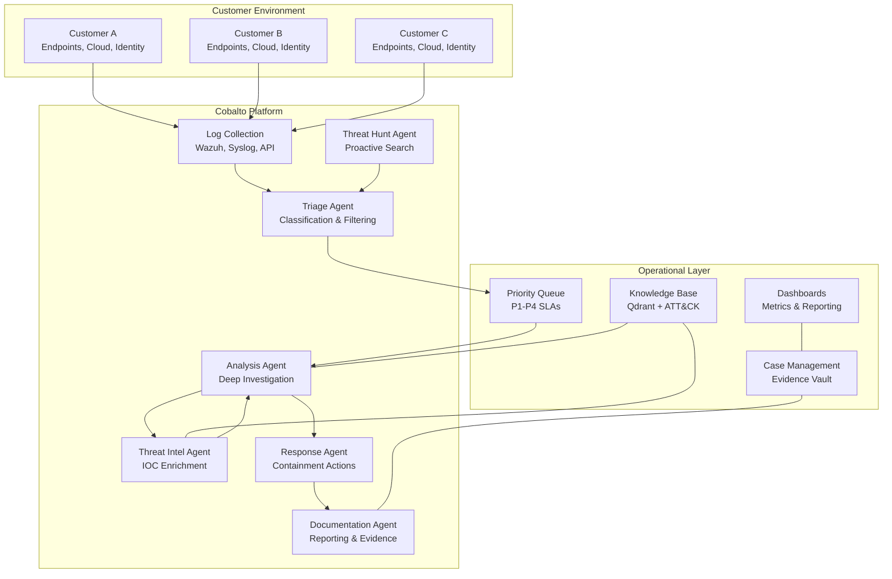
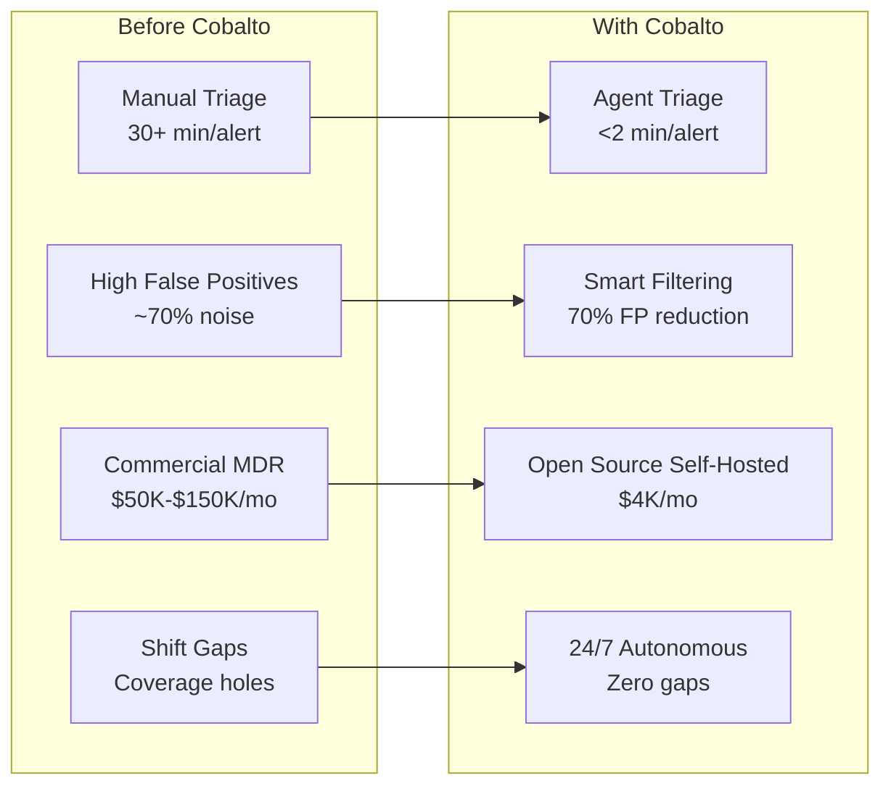
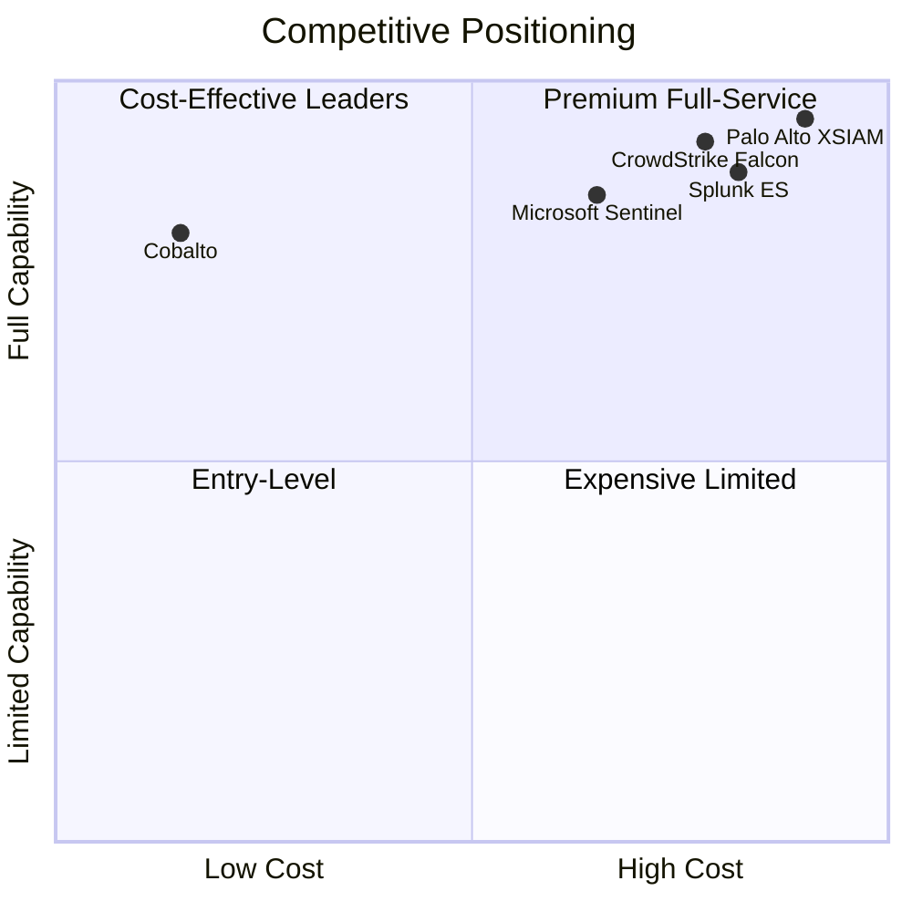
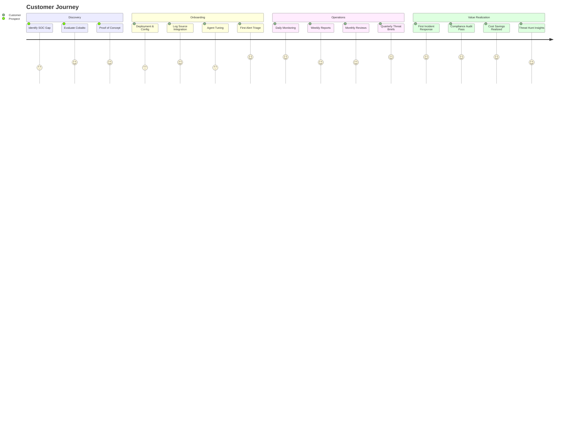
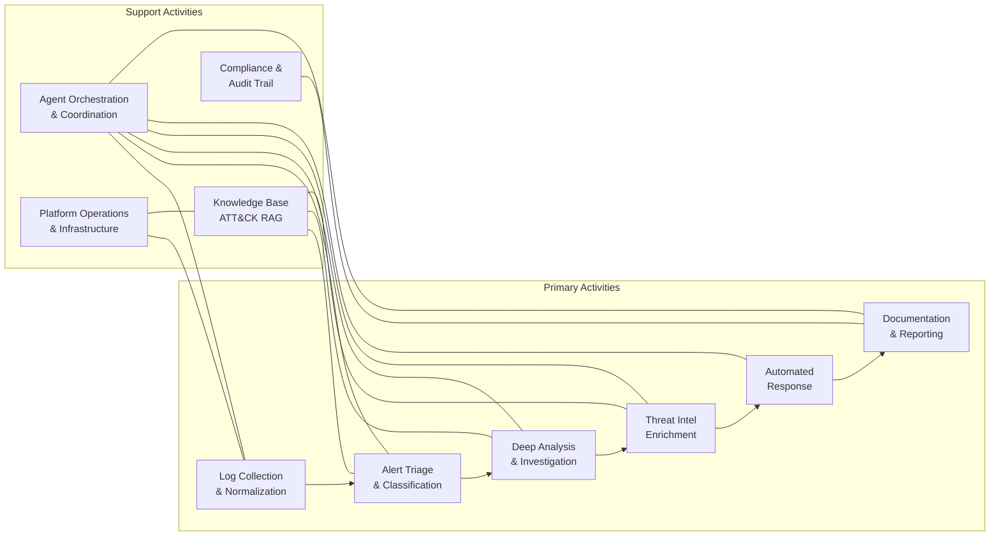

# Business Context — Cobalto Agentic SOC/MDR Platform

## Executive Summary

Cobalto is an open-source Agentic SOC/MDR platform that replaces manual Security Operations Center operations with AI-augmented multi-agent workflows. By orchestrating specialized autonomous agents — Triage, Analysis, Threat Intel, Response, Documentation, and Threat Hunt — Cobalto delivers enterprise-grade managed detection and response capabilities at a fraction of the cost of commercial alternatives. The platform is self-hosted, fully auditable, and designed for organizations that need 24/7 security operations without the overhead of building and staffing an in-house SOC.

## The Business Problem

The cybersecurity industry faces an existential talent crisis that directly impacts organizational security posture:

| Metric | Current State |
|---|---|
| Unfilled cybersecurity roles globally | 4,000,000+ |
| Average breach detection time | 51 seconds (automated) / 200+ days (manual) |
| SOC teams lacking AI-threat expertise | 90%+ |
| Average cost of a data breach (2026) | $5.2M |
| Mean time to identify a breach | 197 days |
| Mean time to contain a breach | 69 days |

Security teams are overwhelmed by alert volume, tool sprawl, and an ever-expanding attack surface. Traditional MDR providers charge $50K–$150K/month for a service that still depends heavily on human analysts working in shifts. The result: high costs, inconsistent quality, and coverage gaps during off-hours.

## Service Model

Cobalto operates as a **Managed Detection and Response (MDR)** service platform, serving multiple customers from a centralized deployment.

### Operational Model

| Dimension | Detail |
|---|---|
| Coverage | 24/7/365 operations |
| Shift Model | Agent-based (no shift handoffs, no fatigue) |
| Alert Source | Wazuh SIEM, cloud APIs, EDR agents, network sensors |
| Escalation | Automated tiered escalation with human-in-the-loop for P1/P2 |
| Reporting | Real-time dashboards, weekly/monthly executive reports |
| SLAs | P1: <15min response, P2: <1hr, P3: <4hr, P4: <24hr |

## Value Proposition

### Quantified Value

| Metric | Before Cobalto | With Cobalto | Improvement |
|---|---|---|---|
| Mean Time to Respond (MTTR) | 30+ minutes | < 2 minutes | 95% reduction |
| False Positive Rate | ~70% | ~21% | 70% reduction |
| Monthly MDR Cost | $50,000–$150,000 | ~$4,000 | 90%+ cost reduction |
| Analyst-to-Endpoint Ratio | 1:500 | 1:5,000+ | 10x efficiency |
| Alert Coverage | Business hours only | 24/7/365 | Complete coverage |
| SOC Team Requirement | 8–15 analysts | 1–2 analysts | 80% headcount reduction |

## Target Customers

### Primary Segments

| Segment | Profile | Pain Point | Value |
|---|---|---|---|
| **Mid-Market Enterprises** | 500–5,000 endpoints | Can't afford or staff a full SOC | Enterprise-grade MDR at SMB cost |
| **MSSPs** | Managed security providers | Margin pressure on analyst costs | Scale revenue without scaling headcount |
| **Regulated Industries** | Healthcare, finance, retail | Compliance mandates (HIPAA, PCI, SOC 2) | Automated evidence generation |
| **Remote/Hybrid Organizations** | Distributed workforce | Cloud-first, no perimeter visibility | Cloud-native detection & response |

### Ideal Customer Profile

- **Endpoint Count**: 500–5,000 (expandable to 50,000+)
- **IT Maturity**: Moderate — has SIEM/logs but lacks 24/7 monitoring
- **Security Budget**: $50K–$500K/year for detection & response
- **Compliance Requirements**: At least one regulatory framework (SOC 2, PCI, HIPAA, ISO 27001)
- **Technical Capability**: Has IT team but no dedicated security analysts

## Revenue Model

### Pricing Structure

| Tier | Endpoint Range | Base Price | Includes |
|---|---|---|---|
| **Starter** | 500–1,000 | $2,500/mo | Triage, Analysis, Documentation, P3/P4 SLAs |
| **Professional** | 1,000–3,000 | $5,000/mo | + Threat Intel, Response, P2 SLAs, weekly reports |
| **Enterprise** | 3,000–5,000 | $9,000/mo | + Threat Hunt, P1 SLAs, compliance reporting, API access |
| **Custom** | 5,000+ | Custom | Dedicated agents, custom integrations, on-site support |

### Per-Endpoint Pricing

| Component | Per Endpoint/Month |
|---|---|
| Base Detection | $1.50 |
| Analysis & Response | $1.00 |
| Threat Intel | $0.50 |
| Threat Hunting | $0.75 |
| Compliance Reporting | $0.25 |
| **Total (Full Stack)** | **$4.00** |

### Add-On Services

| Service | Price | Description |
|---|---|---|
| Threat Hunting Campaign | $2,500/campaign | Proactive hunt with detailed report |
| Incident Response Retainer | $5,000/quarter | Priority IR support, 4-hour SLA |
| Compliance Report Package | $1,500/quarter | PCI, HIPAA, SOC 2 evidence bundles |
| Custom Integration | $5,000 one-time | Connect proprietary log sources |
| Executive Briefing | $2,000/quarter | Quarterly security posture review |

## Competitive Landscape

### Head-to-Head Comparison

| Capability | CrowdStrike Falcon | Microsoft Sentinel | Palo Alto XSIAM | Cobalto |
|---|---|---|---|---|
| **Deployment** | Cloud SaaS | Cloud SaaS | Cloud SaaS | Self-hosted / Cloud |
| **Open Source** | No | No | No | Yes |
| **AI Agents** | Limited (Copilot) | Copilot for Security | Cortex XSIAM | Full multi-agent |
| **Cost (3K endpoints)** | $75K–$100K/mo | $40K–$80K/mo | $100K–$150K/mo | ~$5K/mo |
| **Data Residency** | Vendor cloud | Azure regions | Vendor cloud | Your infrastructure |
| **Customization** | Limited | Moderate | Limited | Fully extensible |
| **Vendor Lock-in** | High | High | High | None |
| **ATT&CK Coverage** | High | High | High | High (RAG-powered) |
| **24/7 Coverage** | Yes (their analysts) | Yes (their analysts) | Yes (their analysts) | Yes (autonomous agents) |

### Key Differentiators

1. **Open Source**: Full transparency, community auditing, no black boxes
2. **Self-Hosted**: Data never leaves your infrastructure — critical for regulated industries
3. **Agent Architecture**: Multi-agent system outperforms single-model approaches
4. **Cost**: 90%+ cheaper than commercial alternatives with comparable capability
5. **No Vendor Lock-in**: Migrate freely, customize without permission, own your stack
6. **Compliance-Ready**: Automated evidence generation for audit frameworks

## Customer Journey

## Value Chain

## Strategic Imperatives

| Priority | Initiative | Impact | Timeline |
|---|---|---|---|
| **P0** | Agent accuracy tuning | Reduce false positives below 15% | Q1 2026 |
| **P0** | SOC 2 Type II certification | Enterprise sales enablement | Q2 2026 |
| **P1** | Marketplace integrations | Expand customer reach | Q2–Q3 2026 |
| **P1** | Compliance automation | Unlock regulated verticals | Q3 2026 |
| **P2** | Multi-tenant scaling | Enable MSSP channel | Q4 2026 |
| **P2** | Threat intelligence feeds | Premium tier differentiation | Q4 2026 |
