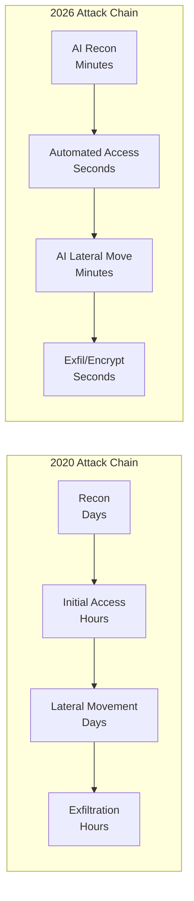
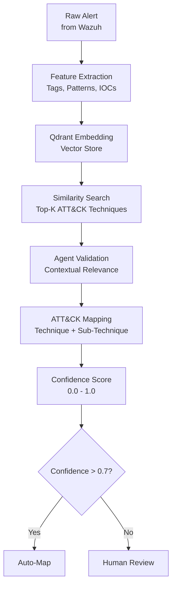
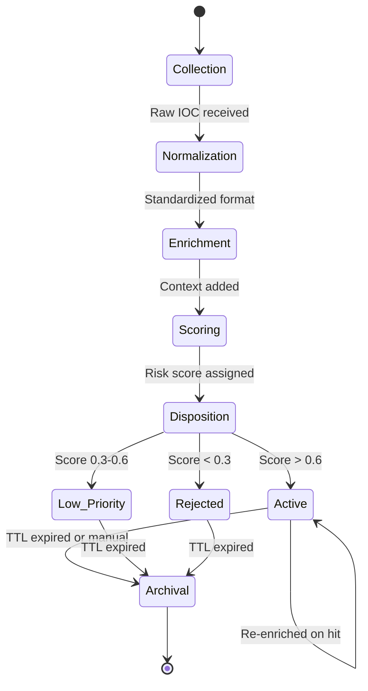
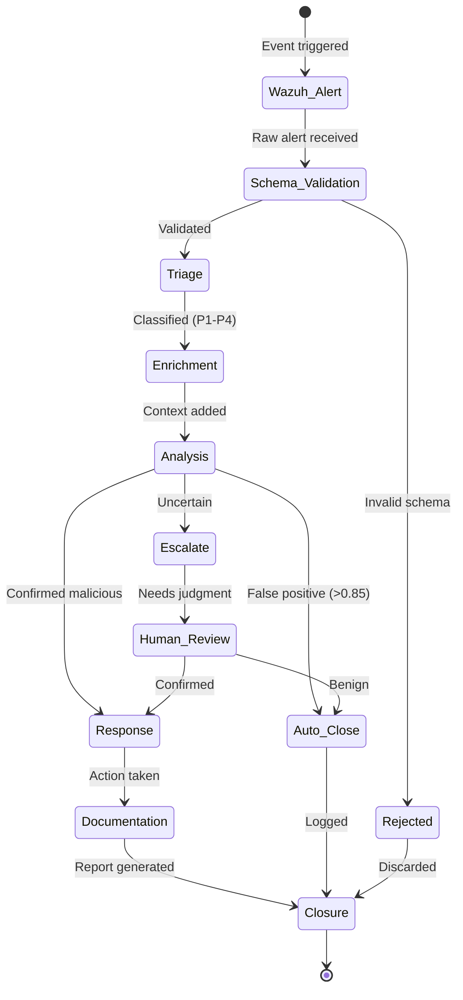
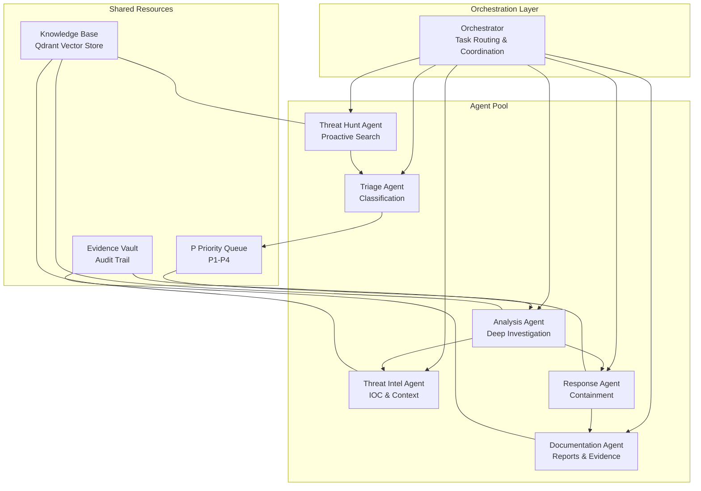
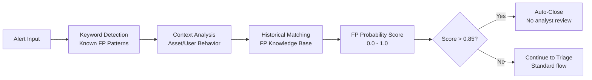
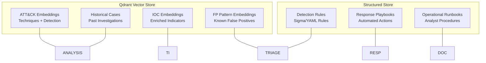

# Domain Model — Cobalto Agentic SOC/MDR Platform

## Threat Landscape 2026

The attack surface has fundamentally shifted. Adversaries now leverage AI to automate reconnaissance, craft hyper-personalized phishing, and move laterally faster than human analysts can respond.

| Threat Category | Trend | Impact on Detection |
|---|---|---|
| **AI-Generated Phishing** | LLM-crafted, context-aware emails | Bypasses traditional signature detection |
| **Automated Lateral Movement** | AI-driven privilege escalation | Compresses dwell time from days to minutes |
| **Cloud Attack Surfaces** | 300%+ expansion in cloud assets | Exceeds human capacity to monitor |
| **Supply Chain Attacks** | Dependency confusion, CI/CD poisoning | Requires proactive hunting, not just reactive detection |
| **Ransomware-as-a-Service** | Democratized, AI-optimized variants | Increased volume and sophistication simultaneously |
| **Identity-Based Attacks** | MFA bypass, token theft, session hijacking | Identity is the new perimeter |

### Attack Velocity



The window between initial compromise and impact has collapsed from **days to minutes**, making autonomous agent response not a luxury but a necessity.

## MITRE ATT&CK Mapping Strategy

Cobalto maps every alert and IOC to the MITRE ATT&CK framework using a RAG (Retrieval-Augmented Generation) pipeline backed by Qdrant vector embeddings.

### Mapping Pipeline



### ATT&CK Coverage

| Tactic | Techniques Covered | Agent Ownership |
|---|---|---|
| **Reconnaissance** | T1592, T1589, T1591 | Threat Hunt Agent |
| **Resource Development** | T1583, T1587, T1588 | Threat Intel Agent |
| **Initial Access** | T1566, T1190, T1133, T1078 | Triage Agent |
| **Execution** | T1059, T1203, T1204 | Analysis Agent |
| **Persistence** | T1547, T1136, T1543, T1546 | Analysis Agent |
| **Privilege Escalation** | T1548, T1068, T1055 | Analysis Agent |
| **Defense Evasion** | T1027, T1070, T1562 | Threat Intel Agent |
| **Credential Access** | T1003, T1110, T1557 | Analysis Agent |
| **Discovery** | T1082, T1083, T1087 | Triage Agent |
| **Lateral Movement** | T1021, T1570, T1563 | Response Agent |
| **Collection** | T1005, T1039, T1114 | Analysis Agent |
| **Exfiltration** | T1041, T1048, T1029 | Response Agent |
| **Impact** | T1486, T1490, T1498 | Response Agent |

### Qdrant Schema

```json
{
  "collection": "attack_techniques",
  "vector_size": 1536,
  "distance": "Cosine",
  "payload_schema": {
    "technique_id": "string",
    "technique_name": "string",
    "tactic": "string",
    "description": "string",
    "detection_guidance": "string",
    "platforms": "string[]",
    "data_sources": "string[]"
  }
}
```

## IOC Lifecycle

Indicators of Compromise flow through a structured pipeline from collection to archival.



### IOC Lifecycle Stages

| Stage | Description | Agent | SLA |
|---|---|---|---|
| **Collection** | Ingest IOCs from feeds, alerts, threat intel sources | Threat Intel Agent | Real-time |
| **Normalization** | Standardize format (STIX 2.1, Observable types) | Automated Pipeline | < 1 second |
| **Enrichment** | Query VirusTotal, Shodan, AbuseIPDB, internal KB | Threat Intel Agent | < 10 seconds |
| **Scoring** | Assign risk score based on context, source, freshness | Analysis Agent | < 30 seconds |
| **Disposition** | Classify as Active, Low-Priority, or Rejected | Analysis Agent | < 1 minute |
| **Active** | IOC is monitored, triggers alerts on matching events | Triage Agent | Continuous |
| **Archival** | IOC is retained for historical analysis, then purged | Automated Pipeline | 90-day default |

### IOC Enrichment Sources

| Source | Data Type | Refresh Rate |
|---|---|---|
| VirusTotal | File/URL/IP reputation | On-demand |
| AbuseIPDB | IP reputation | On-demand |
| Shodan | Internet-facing asset data | On-demand |
| MITRE ATT&CK | Technique context | Weekly sync |
| Internal KB | Historical analysis, FP patterns | Continuous |
| AlienVault OTX | Pulse-based IOCs | Daily sync |
| MISP | Community IOCs | Hourly sync |

## Alert Lifecycle

Every alert follows a deterministic lifecycle from creation to closure.



### Alert Lifecycle Stages

| Stage | Description | Agent | SLA |
|---|---|---|---|
| **Wazuh Alert** | Raw security event generated by Wazuh | Platform | Real-time |
| **Schema Validation** | Verify alert conforms to Cobalto alert schema | Automated | < 1 second |
| **Triage** | Classify alert type, assign severity (P1-P4), deduplicate | Triage Agent | < 2 minutes |
| **Enrichment** | Add context: IOC lookup, asset criticality, user info | Threat Intel Agent | < 5 minutes |
| **Analysis** | Deep investigation: timeline, lateral movement, impact | Analysis Agent | < 15 minutes (P1) |
| **Response** | Containment actions: isolate host, block IP, disable account | Response Agent | < 15 minutes (P1) |
| **Documentation** | Generate incident report with timeline, evidence, recommendations | Documentation Agent | < 30 minutes |
| **Closure** | Archive case, update metrics, feed back to knowledge base | Automated | Immediate |

## Agent Roles

The platform uses specialized agents with distinct responsibilities.



### Agent Specifications

| Agent | Responsibility | Input | Output | SLA |
|---|---|---|---|---|
| **Triage Agent** | Alert classification, severity assignment, deduplication | Raw alerts from queue | Classified alerts (P1-P4) | < 2 min |
| **Analysis Agent** | Deep investigation, timeline reconstruction, impact assessment | Classified alerts | Investigation report, confidence score | < 15 min |
| **Threat Intel Agent** | IOC enrichment, adversary profiling, ATT&CK mapping | Alerts, IOCs | Enriched context, technique mapping | < 5 min |
| **Response Agent** | Automated containment, isolation, blocking, remediation | Confirmed incidents | Containment actions, execution log | < 15 min |
| **Documentation Agent** | Incident reports, audit trails, compliance evidence | Completed incidents | Structured reports (PDF/Markdown) | < 30 min |
| **Threat Hunt Agent** | Proactive threat searches, hypothesis-driven investigations | Hunt hypotheses, IOCs | Hunt findings, recommendations | Variable |

## Severity Model

Alerts are classified into four severity levels, each triggering different response procedures.

| Severity | Level | SLA (Response) | SLA (Resolution) | Agent Actions |
|---|---|---|---|---|
| **CRITICAL (P1)** | Immediate | < 15 minutes | < 4 hours | Auto-isolate, full analysis, CISO notification, incident command |
| **HIGH (P2)** | Urgent | < 1 hour | < 24 hours | Full analysis, threat intel enrichment, client notification |
| **MEDIUM (P3)** | Standard | < 4 hours | < 72 hours | Threat intel enrichment, analysis, standard documentation |
| **LOW (P4)** | Scheduled | < 24 hours | < 7 days | Auto-document, batch analysis, weekly summary |

### Severity Classification Rules

```python
SEVERITY_RULES = {
    "CRITICAL": [
        "Ransomware detonation detected",
        "Data exfiltration confirmed",
        "Domain admin compromise",
        "Active lateral movement in production",
        "Zero-day exploitation indicators"
    ],
    "HIGH": [
        "Malware execution on critical asset",
        "Privilege escalation attempt",
        "Suspicious outbound C2 traffic",
        "Credential dumping detected",
        "Multiple failed auth from external IP"
    ],
    "MEDIUM": [
        "Suspicious process execution",
        "Unusual admin tool usage",
        "Policy violation detected",
        "Anomalous login pattern",
        "New service installed"
    ],
    "LOW": [
        "Informational alert",
        "Failed login (single)",
        "Software update anomaly",
        "Configuration change",
        "Routine scan finding"
    ]
}
```

## False Positive Model

Cobalto implements a multi-layered false positive reduction system.

### FP Detection Pipeline



### FP Scoring Model

| Factor | Weight | Description |
|---|---|---|
| **Keyword Match** | 0.3 | Matches known FP pattern (e.g., update services, monitoring tools) |
| **Asset Criticality** | 0.2 | Non-critical asset reduces FP likelihood |
| **Historical FP Rate** | 0.25 | How often this alert type has been FP before |
| **Temporal Pattern** | 0.1 | Matches expected maintenance windows |
| **Source Reputation** | 0.15 | Trusted source reduces FP probability |

### Auto-Close Thresholds

| FP Score | Action |
|---|---|
| **> 0.85** | Auto-close, log as FP, no analyst review |
| **0.60 – 0.85** | Flag as probable FP, analyst reviews in batch |
| **0.30 – 0.60** | Standard triage, FP suspicion noted |
| **< 0.30** | Treat as genuine alert, full investigation |

### Known False Positive Patterns

| Pattern | Detection Method | FP Score |
|---|---|---|
| Windows Update services | Process name + path matching | 0.92 |
| CrowdStrike/EDR sensor activity | Process signature validation | 0.88 |
| Vulnerability scanner traffic | Source IP + scan pattern matching | 0.85 |
| Backup software operations | Process + schedule correlation | 0.90 |
| Monitoring tool heartbeats | Known agent signatures | 0.95 |
| DNS lookups to known-good domains | Domain reputation check | 0.82 |

## Knowledge Base Architecture



## Data Model

### Core Entities

```yaml
Alert:
  id: UUID
  source: "wazuh" | "cloud" | "edr" | "custom"
  severity: P1 | P2 | P3 | P4
  status: new | triaged | enriching | analyzing | responding | documented | closed
  raw_event: JSONB
  schema_version: string
  created_at: timestamp
  updated_at: timestamp

Case:
  id: UUID
  alert_ids: UUID[]
  severity: P1 | P2 | P3 | P4
  status: open | investigating | contained | eradicated | recovered | closed
  assigned_agent: string
  timeline: Event[]
  evidence: Evidence[]
  created_at: timestamp
  closed_at: timestamp

IOC:
  id: UUID
  type: ip | domain | url | hash | email
  value: string
  confidence: float (0.0 - 1.0)
  status: active | low_priority | rejected | archived
  enrichment: EnrichmentData
  first_seen: timestamp
  last_seen: timestamp
  ttl: duration

Investigation:
  id: UUID
  case_id: UUID
  agent: string
  findings: Finding[]
  timeline: Event[]
  recommendations: string[]
  created_at: timestamp

Response:
  id: UUID
  case_id: UUID
  actions: Action[]
  executed_by: string
  result: success | partial | failed
  executed_at: timestamp
```

### Event Timeline Schema

```yaml
Event:
  id: UUID
  case_id: UUID
  type: alert | enrichment | analysis | response | escalation | note
  agent: string
  summary: string
  details: JSONB
  timestamp: timestamp
  severity: P1 | P2 | P3 | P4
```
