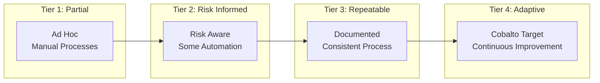
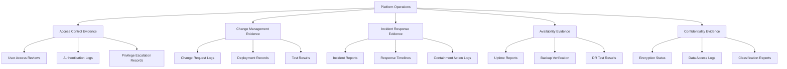
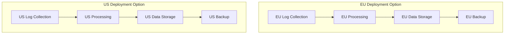

# Regulatory & Compliance Landscape — Cobalto Agentic SOC/MDR Platform

## Overview

Cobalto is designed to operate within and support compliance requirements across major regulatory frameworks. This document maps each regulation to specific platform capabilities and the evidence the platform generates for auditors.

## Framework Mapping Summary

| Framework | Primary Focus | Cobalto Coverage |
|---|---|---|
| NIST CSF 2.0 | Cybersecurity risk management | Full — Detect, Respond, Recover functions |
| SOC 2 Type II | Trust service criteria | Full — all 5 criteria |
| PCI DSS 4.0 | Payment card data protection | Partial — logging, testing, policy alignment |
| HIPAA | Healthcare data (ePHI) protection | Partial — security rule alignment |
| ISO 27001:2022 | Information security management | Partial — Annex A controls |
| GDPR | EU personal data protection | Partial — data handling, residency |

## NIST CSF 2.0

The National Institute of Standards and Technology Cybersecurity Framework version 2.0 provides a structured approach to managing cybersecurity risk.

### Function Mapping

| Function | Sub-Functions | Cobalto Capability | Evidence Generated |
|---|---|---|---|
| **Identify** | ID.AM: Asset Management | Asset discovery via Wazuh agent telemetry, endpoint inventory | Asset inventory reports, endpoint compliance status |
| | ID.RA: Risk Assessment | Risk scoring on alerts, asset criticality weighting | Risk assessment dashboards, vulnerability correlation reports |
| | ID.IM: Improvement | Post-incident reviews, agent performance metrics | Incident post-mortems, false positive trend reports |
| **Protect** | PR.AC: Access Control | Identity-based alert correlation, privileged access monitoring | Access anomaly reports, privilege escalation alerts |
| | PR.DS: Data Security | Data exfiltration detection, DLP alert correlation | Exfiltration attempt logs, data access audit trails |
| | PR.PT: Platform Security | Platform configuration audits, hardening validation | Configuration compliance reports, baseline drift alerts |
| **Detect** | DE.CM: Continuous Monitoring | 24/7 autonomous monitoring via agents | Real-time alert feeds, coverage gap reports |
| | DE.AE: Adverse Event Analysis | Agent-based alert triage and enrichment | Alert classification reports, ATT&CK technique mapping |
| **Respond** | RS.RP: Response Planning | Automated playbooks, escalation procedures | Playbook execution logs, escalation audit trails |
| | RS.CO: Communications | Stakeholder notifications, client reporting | Notification logs, client-facing incident reports |
| | RS.MI: Mitigation | Automated containment, isolation actions | Containment action logs, response time metrics |
| **Recover** | RC.RP: Recovery Planning | Post-incident recovery procedures, lessons learned | Recovery action logs, improvement recommendation reports |

### NIST CSF Maturity Alignment

Cobalto targets **Tier 4 (Adaptive)** for Detect and Respond functions through continuous agent learning and automated improvement loops.

## SOC 2 Type II

Service Organization Control 2 evaluates controls relevant to the five Trust Service Criteria.

### Trust Service Criteria Mapping

| Criteria | Sub-Criteria | Cobalto Controls | Evidence |
|---|---|---|---|
| **CC6.1 - Logical Access** | Access controls, authentication | Role-based access, MFA enforcement, API key management | Access logs, authentication audit trails, key rotation reports |
| **CC6.2 - System Operations** | Change management, configuration | Infrastructure-as-code, version-controlled configs | Deployment logs, change history, config diff reports |
| **CC6.3 - Confidentiality** | Data encryption, access restriction | Encryption at rest/in transit, data classification | Encryption certificates, access control lists, data flow diagrams |
| **CC6.4 - System Availability** | Uptime, disaster recovery | Redundant agents, failover procedures, backups | Uptime metrics, backup verification logs, DR test reports |
| **CC7.1 - Threat Detection** | Monitoring, alerting | Multi-agent monitoring, real-time alerting | Alert volume reports, detection coverage matrices |
| **CC7.2 - Incident Response** | Response, remediation | Automated containment, escalation workflows | Incident timelines, response action logs, SLA compliance reports |
| **CC8.1 - Change Management** | Change control, testing | Staged deployments, automated validation | Deployment approvals, test results, rollback logs |
| **CC9.1 - Risk Management** | Risk assessment, mitigation | Risk scoring, continuous threat modeling | Risk registers, threat landscape reports |

### SOC 2 Evidence Package

## PCI DSS 4.0

Payment Card Industry Data Security Standard requirements relevant to SOC operations.

### Requirements Mapping

| PCI Requirement | Title | Cobalto Alignment | Platform Capability |
|---|---|---|---|
| **Req 10.1** | Log all access to network resources and cardholder data | Full | Wazuh agent logs all access events, correlated by Cobalto |
| **Req 10.2** | Implement automated audit trails | Full | Automated alert lifecycle, immutable audit trail |
| **Req 10.3** | Record audit trail entries for all system components | Full | Structured logging across all agents and infrastructure |
| **Req 10.4** | Review logs and security events | Partial — automated review | Agent-based continuous review, exception escalation |
| **Req 10.5** | Retain audit trail history for at least 12 months | Full | Configurable retention, archival pipeline |
| **Req 11.1** | Test security systems and processes regularly | Full | Vulnerability scan correlation, rule validation |
| **Req 11.2** | Internal vulnerability scans | Full | Wazuh vulnerability detection, automated triage |
| **Req 11.3** | External vulnerability scans | Partial — integration | External scan ingestion, correlation with internal findings |
| **Req 12.1** | Security policy development | Partial — documentation support | Policy templates, compliance evidence generation |
| **Req 12.2** | Risk assessment process | Full | Risk scoring, threat modeling, continuous assessment |
| **Req 12.3** | Acceptable use policies | Partial — monitoring | Policy violation detection, automated enforcement |
| **Req 12.4** | Service provider management | Partial — reporting | Vendor risk monitoring, third-party alert correlation |

### PCI Evidence Artifacts

| Artifact | Source | Retention |
|---|---|---|
| Access audit trails | Wazuh + Cobalto audit log | 12 months minimum |
| Alert classification reports | Triage Agent output | 12 months minimum |
| Incident response timelines | Case management system | Per incident lifecycle |
| Vulnerability scan results | Wazuh scanner integration | 12 months minimum |
| Change management logs | Deployment pipeline | 12 months minimum |
| Penetration test findings | External integration | 12 months minimum |

## HIPAA

Health Insurance Portability and Accountability Act Security Rule requirements for electronic Protected Health Information (ePHI).

### Security Rule Alignment

| Safeguard Type | Requirement | Cobalto Capability | Evidence |
|---|---|---|---|
| **Administrative** | Security management process | Risk analysis, risk management, sanctions, info system activity review | Risk assessment reports, activity review logs |
| | Workforce security | Authorization, supervision, termination procedures | Access provisioning logs, termination audit trails |
| | Information access management | Access authorization, role-based access | Access control matrices, role assignment logs |
| | Security awareness training | (Client responsibility) | Training completion records (client-provided) |
| | Security incident procedures | Response, documentation, mitigation | Incident reports, response timelines, containment logs |
| | Contingency plan | Data backup, disaster recovery, emergency mode | Backup verification, DR test results, emergency access logs |
| | Evaluation | Periodic technical and nontechnical evaluation | Self-assessment reports, configuration audits |
| **Physical** | Facility access controls | (Infrastructure provider responsibility) | Data center access logs (cloud provider) |
| | Workstation security | (Client responsibility) | Endpoint compliance reports |
| | Device/media controls | Asset lifecycle, disposal | Asset inventory, disposal records |
| **Technical** | Access control | Unique user identification, emergency access, auto-logoff, encryption | Authentication logs, encryption status reports |
| | Audit controls | Hardware, software, procedural mechanisms | Audit trail generation, log integrity verification |
| | Integrity controls | ePHI authentication, alteration/destruction prevention | Data integrity checks, tamper-evident logs |
| | Transmission security | Encryption, integrity controls | TLS/encryption status, transmission integrity logs |

### HIPAA Evidence for Audits

| Evidence Type | Cobalto Source | Format |
|---|---|---|
| Risk analysis report | Risk scoring engine | PDF report |
| Audit trail logs | Wazuh + Cobalto audit | Structured JSON, exportable |
| Access review logs | Authentication system | CSV/PDF |
| Incident response records | Case management | PDF incident reports |
| Encryption status | Platform configuration | Automated compliance check |
| Business Associate Agreement | Legal/contractual | Document (client-managed) |

## ISO 27001:2022

Information Security Management System standard — Annex A controls relevant to SOC operations.

### Relevant Annex A Controls

| Control | Category | Title | Cobalto Capability |
|---|---|---|---|
| **A.5.1** | Organizational | Policies for information security | Policy enforcement via detection rules |
| **A.5.7** | Organizational | Threat intelligence | Threat Intel Agent, IOC lifecycle |
| **A.5.15** | Organizational | Access control | Role-based access, MFA, least privilege |
| **A.6.3** | People | Information security awareness, education, and training | (Client responsibility) |
| **A.7.4** | Physical | Physical security monitoring | (Infrastructure provider) |
| **A.8.5** | Technological | Secure authentication | MFA enforcement, API key rotation |
| **A.8.6** | Technological | Capacity management | Auto-scaling, resource monitoring |
| **A.8.7** | Technological | Protection against malware | Endpoint detection, behavioral analysis |
| **A.8.8** | Technological | Management of technical vulnerabilities | Vulnerability detection, triage, tracking |
| **A.8.9** | Technological | Configuration management | IaC, version control, drift detection |
| **A.8.10** | Technological | Information deletion | Automated data lifecycle management |
| **A.8.11** | Technological | Data masking | Data classification, sensitivity labeling |
| **A.8.12** | Technological | Data leakage prevention | DLP alert correlation, exfiltration detection |
| **A.8.16** | Technological | Monitoring activities | 24/7 agent monitoring, real-time alerting |
| **A.8.20** | Technological | Network security | Network traffic analysis, anomaly detection |
| **A.8.23** | Technological | Web filtering | URL reputation, phishing detection |
| **A.8.24** | Technological | Use of cryptography | Encryption at rest/in transit |
| **A.8.25** | Technological | Secure development lifecycle | (DevSecOps responsibility) |
| **A.8.26** | Technological | Application security requirements | (DevSecOps responsibility) |
| **A.8.28** | Technological | Secure coding | (DevSecOps responsibility) |

## GDPR

General Data Protection Regulation — data handling requirements for EU personal data.

### GDPR Compliance Mapping

| Principle | Article | Cobalto Capability | Evidence |
|---|---|---|---|
| **Lawfulness, fairness, transparency** | Art. 5(1)(a) | Clear data processing purposes, consent management | Data processing agreements, privacy notices |
| **Purpose limitation** | Art. 5(1)(b) | Data used only for security monitoring | Purpose limitation policy, data flow documentation |
| **Data minimization** | Art. 5(1)(c) | Only necessary data collected, configurable retention | Data inventory, retention schedules |
| **Accuracy** | Art. 5(1)(d) | Automated data validation, deduplication | Data quality reports |
| **Storage limitation** | Art. 5(1)(e) | Configurable TTL, automated archival/purge | Retention policy config, purge logs |
| **Integrity & confidentiality** | Art. 5(1)(f) | Encryption, access controls, audit trails | Encryption status, access logs |
| **Data residency** | Art. 44-49 | Self-hosted deployment, region selection | Deployment location documentation |
| **Right to erasure** | Art. 17 | Configurable data deletion procedures | Deletion request logs, verification |
| **Data breach notification** | Art. 33-34 | Automated breach detection, response workflows | Incident reports, notification logs |
| **Data Protection Impact Assessment** | Art. 35 | Risk assessment capabilities, documentation | DPIA templates, risk assessment reports |
| **Data Processing Agreements** | Art. 28 | MDR service contractual framework | DPA documents (client-managed) |

### Data Residency Architecture

## Compliance Evidence Summary

### Evidence Generated by Cobalto

| Evidence Type | Generated By | Format | Retention |
|---|---|---|---|
| **Audit Trail Logs** | All agents | Structured JSON | Configurable (default: 1 year) |
| **Incident Reports** | Documentation Agent | PDF/Markdown | Per incident (default: 3 years) |
| **Alert Classification Reports** | Triage Agent | Structured JSON, CSV | 1 year |
| **Response Action Logs** | Response Agent | Structured JSON | Per incident |
| **SLA Compliance Metrics** | Platform metrics | Dashboard, PDF reports | 1 year |
| **False Positive Reports** | Triage/Analysis Agents | CSV, PDF | 1 year |
| **Threat Intelligence Reports** | Threat Intel Agent | PDF/Markdown | 1 year |
| **Vulnerability Assessment Reports** | Wazuh integration | PDF, JSON | 1 year |
| **Access Control Reports** | Platform | CSV, PDF | 1 year |
| **Configuration Audit Reports** | Platform | JSON, PDF | 1 year |
| **Compliance Dashboards** | Reporting layer | Real-time web, PDF export | Continuous |

### Audit Readiness Checklist

| Audit Activity | Cobalto Support | Status |
|---|---|---|
| Log source inventory | Wazuh agent catalog | Automated |
| Access review | Authentication logs | Automated |
| Incident review | Case management | Automated |
| Configuration review | IaC + drift detection | Automated |
| Vulnerability review | Wazuh scan results | Automated |
| Policy compliance | Rule-based enforcement | Semi-automated |
| Risk assessment | Continuous risk scoring | Automated |
| Evidence collection | Automated artifact generation | Automated |
