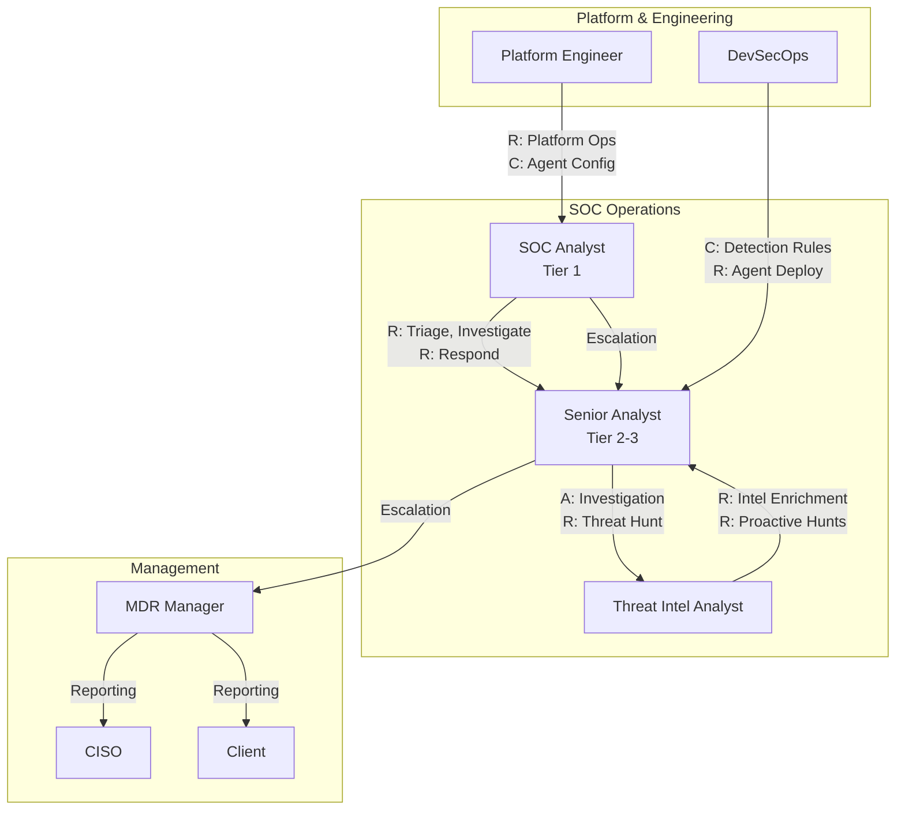
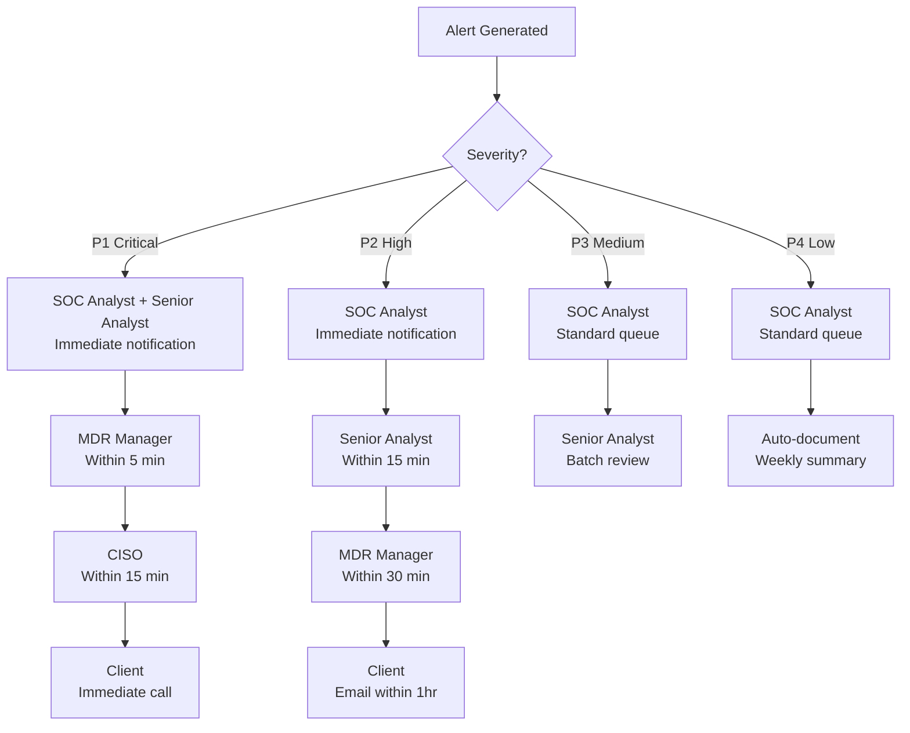
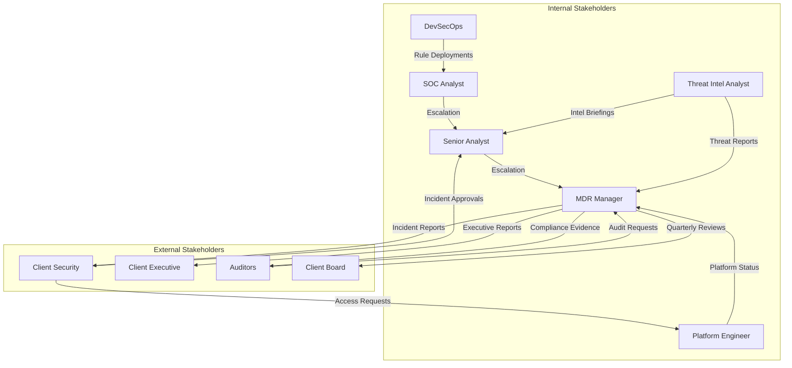

# Stakeholder Map — Cobalto Agentic SOC/MDR Platform

## RACI Matrix

### Legend

| Letter | Meaning |
|---|---|
| **R** | Responsible — does the work |
| **A** | Accountable — owns the outcome |
| **C** | Consulted — provides input |
| **I** | Informed — kept up to date |

### Key Activities

| Activity | SOC Analyst | Senior Analyst | MDR Manager | CISO | Client | Platform Engineer | DevSecOps | Threat Intel Analyst |
|---|---|---|---|---|---|---|---|---|
| **Alert Triage** | R | A | I | — | I | — | — | C |
| **Incident Investigation** | R | A | I | I | I | — | — | R |
| **Incident Response** | R | A | I | C | I | C | — | C |
| **Threat Hunting** | C | R | A | I | I | — | — | R |
| **Threat Intel Operations** | — | C | I | — | — | — | — | R/A |
| **Reporting (Client)** | — | C | R/A | I | I | — | — | — |
| **Reporting (Executive)** | — | — | R | A | I | — | — | — |
| **Platform Operations** | — | — | C | I | — | R/A | C | — |
| **Agent Configuration** | C | C | A | — | — | R | C | C |
| **Detection Rule Tuning** | R | A | I | — | — | C | C | R |
| **Compliance Reporting** | — | C | R/A | C | I | C | C | — |
| **Client Onboarding** | — | C | R/A | I | R | C | — | — |
| **Escalation (P1)** | R | R | A | C | I | C | — | C |
| **Escalation (P2-P4)** | R | A | I | — | I | — | — | C |
| **Post-Incident Review** | R | R | A | I | C | C | — | R |

### RACI Diagram

## Stakeholder Roles

### SOC Analyst (Tier 1)

| Attribute | Detail |
|---|---|
| **Primary Responsibility** | First-line alert triage and classification |
| **RACI Role** | Responsible for triage, initial investigation, P3/P4 response |
| **Escalation Authority** | Escalate to Senior Analyst for P1/P2 or uncertain alerts |
| **Key Interfaces** | Triage Agent, Response Agent, Documentation Agent |
| **Metrics** | Alert processing time, triage accuracy, false positive identification |
| **Tools** | Cobalto console, Wazuh dashboard, ticketing system |

### Senior Analyst (Tier 2-3)

| Attribute | Detail |
|---|---|
| **Primary Responsibility** | Deep investigation, incident management, quality assurance |
| **RACI Role** | Accountable for investigation outcomes, responsible for complex analysis |
| **Escalation Authority** | Escalate to MDR Manager for P1 or client-impacting incidents |
| **Key Interfaces** | Analysis Agent, Threat Intel Agent, all agents |
| **Metrics** | MTTR, investigation quality, analyst-to-agent effectiveness |
| **Tools** | Cobalto console, ATT&CK mapper, knowledge base |

### MDR Manager

| Attribute | Detail |
|---|---|
| **Primary Responsibility** | Service delivery, SLA management, client relationships |
| **RACI Role** | Accountable for all client-facing outcomes, responsible for reporting |
| **Escalation Authority** | Escalate to CISO for critical incidents or client executive engagement |
| **Key Interfaces** | Documentation Agent, all analysts, client contacts |
| **Metrics** | SLA compliance, client satisfaction, revenue retention |
| **Tools** | Cobalto dashboards, reporting engine, CRM |

### CISO

| Attribute | Detail |
|---|---|
| **Primary Responsibility** | Executive oversight, risk governance, strategic direction |
| **RACI Role** | Accountable for security posture, informed on major incidents |
| **Escalation Authority** | Executive decision maker for P1 incidents |
| **Key Interfaces** | MDR Manager, board, regulatory contacts |
| **Metrics** | Overall risk reduction, compliance posture, cost efficiency |
| **Tools** | Executive dashboards, board reports, risk registers |

### Client

| Attribute | Detail |
|---|---|
| **Primary Responsibility** | Provide access, approve response actions, consume reports |
| **RACI Role** | Responsible for onboarding cooperation, accountable for their environment |
| **Escalation Authority** | Approve containment actions that impact business operations |
| **Key Interfaces** | MDR Manager, Cobalto portal, reports |
| **Metrics** | Security posture improvement, ROI, SLA adherence |
| **Tools** | Cobalto client portal, reports, notification channels |

### Platform Engineer

| Attribute | Detail |
|---|---|
| **Primary Responsibility** | Platform reliability, performance, infrastructure |
| **RACI Role** | Responsible for platform operations, accountable for uptime |
| **Escalation Authority** | Escalate infrastructure issues to DevSecOps |
| **Key Interfaces** | All agents, infrastructure, monitoring systems |
| **Metrics** | Platform uptime, response time, infrastructure cost |
| **Tools** | Kubernetes, Terraform, monitoring stack |

### DevSecOps

| Attribute | Detail |
|---|---|
| **Primary Responsibility** | CI/CD, deployment, detection rule development, security |
| **RACI Role** | Responsible for rule deployment, accountable for detection quality |
| **Escalation Authority** | Escalate security issues to SOC team |
| **Key Interfaces** | Platform Engineer, SOC Analysts, Detection rules |
| **Metrics** | Deployment frequency, rule coverage, false positive rate |
| **Tools** | GitHub, Terraform, Sigma rule repository |

### Threat Intel Analyst

| Attribute | Detail |
|---|---|
| **Primary Responsibility** | IOC management, adversary tracking, threat landscape analysis |
| **RACI Role** | Responsible for threat intel, accountable for IOC quality |
| **Escalation Authority** | Escalate critical threat intel to Senior Analyst |
| **Key Interfaces** | Threat Intel Agent, external feeds, ATT&CK knowledge base |
| **Metrics** | IOC accuracy, enrichment coverage, threat landscape coverage |
| **Tools** | MISP, Qdrant, OSINT platforms |

## Communication Flows

### Alert Escalation Matrix

### Notification Routing

| Event | Recipient | Channel | SLA |
|---|---|---|---|
| P1 Alert Created | SOC Analyst, Senior Analyst | Real-time alert + SMS | Immediate |
| P1 Escalation | MDR Manager, CISO | Phone call + SMS | < 5 minutes |
| P1 Client Notification | Client Security Lead | Phone call + email | < 15 minutes |
| P2 Alert Created | SOC Analyst | Real-time alert | Immediate |
| P2 Escalation | Senior Analyst | Alert + email | < 15 minutes |
| P2 Client Notification | Client Security Lead | Email | < 1 hour |
| P3 Alert Created | SOC Analyst | Queue notification | < 1 hour |
| P4 Alert Created | SOC Analyst | Queue batch | < 4 hours |
| Incident Closed | MDR Manager, Client | Email report | < 2 hours |
| Weekly Report | MDR Manager, CISO, Client | Email + dashboard | Monday AM |
| Monthly Report | CISO, Client Executive | PDF report | 1st of month |
| Quarterly Review | CISO, Client Executive | Presentation + meeting | Scheduled |
| SLA Breach | MDR Manager, CISO | Real-time alert | Immediate |
| Platform Outage | Platform Engineer, CISO | PagerDuty + SMS | Immediate |

### Reporting Cadence

| Report | Audience | Frequency | Format |
|---|---|---|---|
| **Real-Time Dashboard** | SOC Analyst, Senior Analyst | Continuous | Web UI |
| **Shift Handoff Summary** | SOC Analyst, Senior Analyst | Every 12 hours | Email |
| **Daily Security Brief** | MDR Manager, Client | Daily | Email + dashboard |
| **Weekly Executive Summary** | CISO, Client Executive | Weekly | PDF |
| **Monthly Security Posture** | CISO, Client Executive | Monthly | PDF + presentation |
| **Quarterly Threat Landscape** | CISO, Client Board | Quarterly | Presentation |
| **Annual Security Review** | CISO, Client Board | Annually | PDF + meeting |
| **Incident Report** | MDR Manager, Client | Per incident | PDF |
| **Compliance Report** | CISO, Client, Auditors | Per audit cycle | PDF |
| **SLA Performance** | MDR Manager, Client | Monthly | Dashboard + PDF |

## Stakeholder Interaction Map

