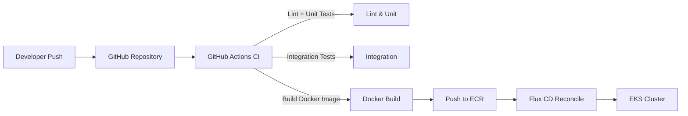
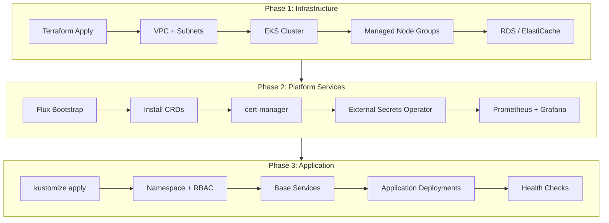
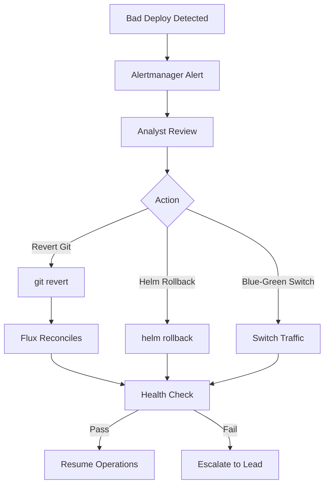
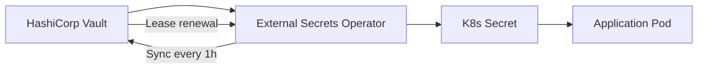
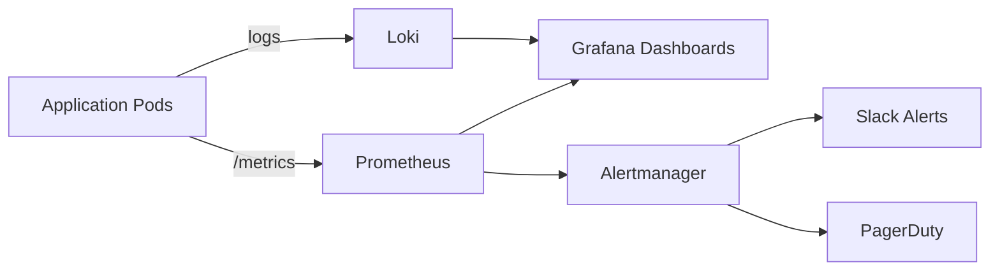

# Deployment Framework

## GitOps Pipeline



### Pipeline Stages

| Stage | Tool | Trigger | Duration |
|-------|------|---------|----------|
| Lint & Typecheck | ruff, mypy | Every push | ~30s |
| Unit Tests | pytest | Every push | ~60s |
| Integration Tests | pytest + services | Pull requests | ~3m |
| Docker Build | docker buildx | Merge to main | ~5m |
| ECR Push | aws ecr | After build | ~1m |
| Flux Reconciliation | Flux CD | Every 5min or webhook | ~3m |
| Health Check | kubectl + curl | Post-deploy | ~1m |

### GitHub Actions Workflow

```yaml
# .github/workflows/deploy.yml
name: Build and Deploy

on:
  push:
    branches: [main]
    paths:
      - 'app/**'
      - 'Dockerfile'
      - 'k8s/**'

env:
  AWS_REGION: us-east-1
  ECR_REPOSITORY: cobalto
  CLUSTER_NAME: cobalto-prod
  K8S_NAMESPACE: cobalto

jobs:
  test:
    runs-on: ubuntu-latest
    steps:
      - uses: actions/checkout@v4
      - uses: actions/setup-python@v5
        with: { python-version: "3.12" }
      - run: pip install -r requirements.txt -r requirements-dev.txt
      - run: ruff check app/
      - run: mypy app/ --strict
      - run: pytest tests/unit/ -v --cov=app --cov-fail-under=80
      - run: pytest tests/integration/ -v --cov-fail-under=60

  build-and-push:
    needs: test
    runs-on: ubuntu-latest
    outputs:
      image_tag: ${{ steps.meta.outputs.version }}
    steps:
      - uses: actions/checkout@v4
      - uses: aws-actions/configure-aws-credentials@v4
        with:
          aws-access-key-id: ${{ secrets.AWS_ACCESS_KEY_ID }}
          aws-secret-access-key: ${{ secrets.AWS_SECRET_ACCESS_KEY }}
          aws-region: ${{ env.AWS_REGION }}
      - uses: aws-actions/amazon-ecr-login@v2
        id: login-ecr
      - uses: docker/setup-buildx-action@v3
      - uses: docker/metadata-action@v5
        id: meta
        with:
          images: ${{ steps.login-ecr.outputs.registry }}/${{ env.ECR_REPOSITORY }}
          tags: |
            type=sha,prefix=
            type=raw,value=latest
      - uses: docker/build-push-action@v5
        with:
          context: .
          push: true
          tags: ${{ steps.meta.outputs.tags }}
          cache-from: type=gha
          cache-to: type=gha,mode=max

  deploy:
    needs: build-and-push
    runs-on: ubuntu-latest
    steps:
      - uses: actions/checkout@v4
      - name: Update image tag in Flux config
        run: |
          cd k8s/overlays/prod
          kustomize edit set image \
            ghcr.io/cobalto-langgraph=${{ needs.build-and-push.outputs.image_tag }}
      - name: Commit and push
        run: |
          git config user.name "github-actions[bot]"
          git config user.email "github-actions[bot]@users.noreply.github.com"
          git add k8s/overlays/prod/kustomization.yaml
          git commit -m "chore: deploy ${{ needs.build-and-push.outputs.image_tag }}"
          git push
```

---

## Kustomize Pattern

### Directory Structure

```
k8s/
├── base/
│   ├── kustomization.yaml
│   ├── namespace.yaml
│   ├── langgraph-api.yaml
│   ├── langgraph-worker.yaml
│   ├── n8n.yaml
│   ├── redis.yaml
│   ├── qdrant.yaml
│   ├── network-policy.yaml
│   └── service-monitor.yaml
├── overlays/
│   ├── dev/
│   │   ├── kustomization.yaml
│   │   ├── patches/
│   │   │   ├── langgraph-api-replicas.yaml
│   │   │   ├── langgraph-worker-replicas.yaml
│   │   │   └── resource-limits.yaml
│   │   └── namespace.yaml
│   ├── staging/
│   │   ├── kustomization.yaml
│   │   ├── patches/
│   │   │   ├── langgraph-api-replicas.yaml
│   │   │   └── hpa.yaml
│   │   └── namespace.yaml
│   └── prod/
│       ├── kustomization.yaml
│       ├── patches/
│       │   ├── langgraph-api-replicas.yaml
│       │   ├── langgraph-worker-replicas.yaml
│       │   ├── hpa.yaml
│       │   ├── pod-disruption-budget.yaml
│       │   └── topology-spread.yaml
│       └── namespace.yaml
└── components/
    ├── monitoring/
    │   ├── prometheus-rules.yaml
    │   └── grafana-dashboard.yaml
    └── security/
        ├── rbac.yaml
        └── network-policy.yaml
```

### Base Manifests

```yaml
# k8s/base/kustomization.yaml
apiVersion: kustomize.config.k8s.io/v1beta1
kind: Kustomization

resources:
  - namespace.yaml
  - langgraph-api.yaml
  - langgraph-worker.yaml
  - n8n.yaml
  - redis.yaml
  - qdrant.yaml
  - network-policy.yaml

commonLabels:
  app.kubernetes.io/part-of: cobalto
  app.kubernetes.io/managed-by: kustomize
```

```yaml
# k8s/base/langgraph-api.yaml
apiVersion: apps/v1
kind: Deployment
metadata:
  name: langgraph-api
  labels:
    app: langgraph-api
    tier: api
spec:
  selector:
    matchLabels:
      app: langgraph-api
  template:
    metadata:
      labels:
        app: langgraph-api
        tier: api
    spec:
      serviceAccountName: cobalto-sa
      containers:
        - name: api
          image: ghcr.io/cobalto-langgraph:latest
          ports:
            - containerPort: 8000
              name: http
          env:
            - name: REDIS_URL
              valueFrom:
                secretKeyRef:
                  name: cobalto-secrets
                  key: redis-url
            - name: QDRANT_URL
              valueFrom:
                secretKeyRef:
                  name: cobalto-secrets
                  key: qdrant-url
            - name: OPENAI_API_KEY
              valueFrom:
                secretKeyRef:
                  name: cobalto-secrets
                  key: openai-api-key
          resources:
            requests:
              cpu: 500m
              memory: 512Mi
            limits:
              cpu: 2000m
              memory: 2Gi
          livenessProbe:
            httpGet:
              path: /health
              port: 8000
            initialDelaySeconds: 30
            periodSeconds: 10
          readinessProbe:
            httpGet:
              path: /ready
              port: 8000
            initialDelaySeconds: 10
            periodSeconds: 5
---
apiVersion: v1
kind: Service
metadata:
  name: langgraph-api
spec:
  selector:
    app: langgraph-api
  ports:
    - port: 8000
      targetPort: 8000
      name: http
  type: ClusterIP
```

### Environment Overlays

#### Dev Overlay

```yaml
# k8s/overlays/dev/kustomization.yaml
apiVersion: kustomize.config.k8s.io/v1beta1
kind: Kustomization

resources:
  - ../../base

patches:
  - path: patches/langgraph-api-replicas.yaml
  - path: patches/langgraph-worker-replicas.yaml
  - path: patches/resource-limits.yaml

namespace: cobalto-dev

images:
  - name: ghcr.io/cobalto-langgraph
    newTag: dev-latest

configMapGenerator:
  - name: cobalto-config
    behavior: merge
    literals:
      - LOG_LEVEL=debug
      - ENVIRONMENT=dev
      - RATE_LIMIT_ENABLED=false
```

```yaml
# k8s/overlays/dev/patches/langgraph-api-replicas.yaml
apiVersion: apps/v1
kind: Deployment
metadata:
  name: langgraph-api
spec:
  replicas: 1
  template:
    spec:
      containers:
        - name: api
          resources:
            requests:
              cpu: 250m
              memory: 256Mi
            limits:
              cpu: 1000m
              memory: 1Gi
```

#### Staging Overlay

```yaml
# k8s/overlays/staging/kustomization.yaml
apiVersion: kustomize.config.k8s.io/v1beta1
kind: Kustomization

resources:
  - ../../base

patches:
  - path: patches/langgraph-api-replicas.yaml
  - path: patches/hpa.yaml

namespace: cobalto-staging

images:
  - name: ghcr.io/cobalto-langgraph
    newTag: staging-latest

configMapGenerator:
  - name: cobalto-config
    behavior: merge
    literals:
      - LOG_LEVEL=info
      - ENVIRONMENT=staging
      - RATE_LIMIT_ENABLED=true
      - RATE_LIMIT_RPS=50
```

#### Prod Overlay

```yaml
# k8s/overlays/prod/kustomization.yaml
apiVersion: kustomize.config.k8s.io/v1beta1
kind: Kustomization

resources:
  - ../../base
  - ../../components/monitoring
  - ../../components/security

patches:
  - path: patches/langgraph-api-replicas.yaml
  - path: patches/langgraph-worker-replicas.yaml
  - path: patches/hpa.yaml
  - path: patches/pod-disruption-budget.yaml
  - path: patches/topology-spread.yaml

namespace: cobalto-prod

images:
  - name: ghcr.io/cobalto-langgraph
    newTag: latest

configMapGenerator:
  - name: cobalto-config
    behavior: merge
    literals:
      - LOG_LEVEL=warning
      - ENVIRONMENT=prod
      - RATE_LIMIT_ENABLED=true
      - RATE_LIMIT_RPS=200
      - CIRCUIT_BREAKER_ENABLED=true
```

```yaml
# k8s/overlays/prod/patches/langgraph-api-replicas.yaml
apiVersion: apps/v1
kind: Deployment
metadata:
  name: langgraph-api
spec:
  replicas: 3
  strategy:
    type: RollingUpdate
    rollingUpdate:
      maxSurge: 1
      maxUnavailable: 0
  template:
    spec:
      topologySpreadConstraints:
        - maxSkew: 1
          topologyKey: topology.kubernetes.io/zone
          whenUnsatisfiable: DoNotSchedule
          labelSelector:
            matchLabels:
              app: langgraph-api
      containers:
        - name: api
          resources:
            requests:
              cpu: 1000m
              memory: 1Gi
            limits:
              cpu: 4000m
              memory: 4Gi
```

---

## Environment Strategy

| Environment | Replicas | Instance Type | Multi-AZ | Auto-scaling |
|-------------|----------|--------------|----------|-------------|
| Dev | 1 | Spot (t3.large) | No | No |
| Staging | 2 | On-demand (m5.xlarge) | No | HPA 2-4 |
| Prod | 3+ | On-demand (m5.2xlarge) | Yes (3 AZs) | HPA 3-10 |

### Dev Configuration

- Spot instances for cost savings
- Single replica, no HA requirements
- Debug logging enabled
- Rate limiting disabled for testing
- External service mocking available

### Staging Configuration

- 2 replicas for basic redundancy
- HPA for load testing
- Production-like data (anonymized)
- Integration tests run against staging

### Prod Configuration

- 3+ replicas across 3 AZs
- Pod Disruption Budget (minAvailable: 2)
- Topology spread constraints for zone awareness
- HPA with custom metrics (alert queue depth)
- Circuit breaker and rate limiting enabled
- Comprehensive monitoring and alerting

---

## Deployment Sequence



### Terraform Infrastructure

```hcl
# infrastructure/terraform/main.tf
module "vpc" {
  source  = "terraform-aws-modules/vpc/aws"
  version = "5.5.0"

  name = "cobalto-vpc"
  cidr = "10.0.0.0/16"

  azs             = ["us-east-1a", "us-east-1b", "us-east-1c"]
  private_subnets = ["10.0.1.0/24", "10.0.2.0/24", "10.0.3.0/24"]
  public_subnets  = ["10.0.101.0/24", "10.0.102.0/24", "10.0.103.0/24"]

  enable_nat_gateway   = true
  single_nat_gateway   = false
  enable_dns_hostnames = true
}

module "eks" {
  source  = "terraform-aws-modules/eks/aws"
  version = "20.0.0"

  cluster_name    = "cobalto-prod"
  cluster_version = "1.29"

  vpc_id     = module.vpc.vpc_id
  subnet_ids = module.vpc.private_subnets

  eks_managed_node_groups = {
    core = {
      min_size     = 3
      max_size     = 10
      desired_size = 3
      instance_types = ["m5.2xlarge"]
      labels = { tier = "core" }
    }
    tools = {
      min_size     = 1
      max_size     = 3
      desired_size = 2
      instance_types = ["m5.xlarge"]
      labels = { tier = "tools" }
    }
  }
}
```

---

## Rollback Strategy

### Flux CD Reconciliation



### Git Revert (Preferred)

```bash
# Revert last commit
git revert HEAD
git push origin main

# Flux detects change and reconciles within 5 minutes
# Or trigger immediate reconciliation:
flux reconcile kustomization cobalto --with-source
```

### Helm Rollback

```bash
# List releases
helm list -n cobalto-prod

# Rollback to previous version
helm rollback langgraph-api 1 -n cobalto-prod

# Rollback to specific revision
helm rollback langgraph-api 5 -n cobalto-prod
```

### Blue-Green Deployment

```yaml
# k8s/overlays/prod/langgraph-api-bluegreen.yaml
apiVersion: apps/v1
kind: Deployment
metadata:
  name: langgraph-api-blue
  labels:
    app: langgraph-api
    slot: blue
spec:
  replicas: 3
  selector:
    matchLabels:
      app: langgraph-api
      slot: blue
  template:
    metadata:
      labels:
        app: langgraph-api
        slot: blue
    spec:
      containers:
        - name: api
          image: ghcr.io/cobalto-langgraph:stable
---
apiVersion: apps/v1
kind: Deployment
metadata:
  name: langgraph-api-green
  labels:
    app: langgraph-api
    slot: green
spec:
  replicas: 0
  selector:
    matchLabels:
      app: langgraph-api
      slot: green
  template:
    metadata:
      labels:
        app: langgraph-api
        slot: green
    spec:
      containers:
        - name: api
          image: ghcr.io/cobalto-langgraph:latest
---
apiVersion: v1
kind: Service
metadata:
  name: langgraph-api
spec:
  selector:
    app: langgraph-api
    slot: blue
  ports:
    - port: 8000
      targetPort: 8000
```

```bash
# Promote green to active
kubectl patch service langgraph-api -p '{"spec":{"selector":{"slot":"green"}}}'

# Scale up green, scale down blue
kubectl scale deployment langgraph-api-green --replicas=3 -n cobalto-prod
kubectl scale deployment langgraph-api-blue --replicas=0 -n cobalto-prod
```

---

## Secret Management

### Vault → External Secrets Operator → K8s Secrets



### External Secret Definition

```yaml
# k8s/base/external-secret.yaml
apiVersion: external-secrets.io/v1beta1
kind: ExternalSecret
metadata:
  name: cobalto-secrets
  namespace: cobalto-prod
spec:
  refreshInterval: 1h
  secretStoreRef:
    name: vault-backend
    kind: SecretStore
  target:
    name: cobalto-secrets
    creationPolicy: Owner
  data:
    - secretKey: redis-url
      remoteRef:
        key: cobalto/prod/redis
        property: url
    - secretKey: qdrant-url
      remoteRef:
        key: cobalto/prod/qdrant
        property: url
    - secretKey: openai-api-key
      remoteRef:
        key: cobalto/prod/llm
        property: openai-api-key
    - secretKey: misp-api-key
      remoteRef:
        key: cobalto/prod/misp
        property: api-key
    - secretKey: cortex-token
      remoteRef:
        key: cobalto/prod/cortex
        property: token
    - secretKey: opencti-token
      remoteRef:
        key: cobalto/prod/opencti
        property: token
    - secretKey: thehive-api-key
      remoteRef:
        key: cobalto/prod/thehive
        property: api-key
```

### Secret Store Configuration

```yaml
apiVersion: external-secrets.io/v1beta1
kind: SecretStore
metadata:
  name: vault-backend
  namespace: cobalto-prod
spec:
  provider:
    vault:
      server: "https://vault.cobalto.internal:8200"
      path: "secret"
      version: "v2"
      auth:
        kubernetes:
          mountPath: "kubernetes"
          role: "cobalto"
          serviceAccountRef:
            name: cobalto-sa
```

---

## Monitoring Stack

### Architecture



### Prometheus Scrape Configuration

```yaml
# k8s/components/monitoring/service-monitor.yaml
apiVersion: monitoring.coreos.com/v1
kind: ServiceMonitor
metadata:
  name: langgraph-api
  namespace: cobalto-prod
  labels:
    release: prometheus
spec:
  selector:
    matchLabels:
      app: langgraph-api
  endpoints:
    - port: http
      path: /metrics
      interval: 15s
```

### Key Metrics and Alerts

| Metric | Alert Threshold | Severity |
|--------|----------------|----------|
| `http_requests_total` rate > 500/s | High traffic spike | Warning |
| `http_request_duration_seconds` p95 > 5s | Slow responses | Warning |
| `agent_execution_duration_seconds` p95 > 60s | Agent bottleneck | Critical |
| `tool_call_failures_total` rate > 5/min | Tool degradation | Critical |
| `llm_api_errors_total` rate > 3/min | LLM provider issue | Critical |
| `pod_memory_usage_bytes` > 80% limit | Memory pressure | Warning |
| `pod_restart_total` > 3 in 1h | Crash loop | Critical |
| `queue_depth` > 100 | Alert backlog | Warning |

### Alertmanager Rules

```yaml
# k8s/components/monitoring/prometheus-rules.yaml
apiVersion: monitoring.coreos.com/v1
kind: PrometheusRule
metadata:
  name: cobalto-alerts
  namespace: cobalto-prod
spec:
  groups:
    - name: cobalto.agent
      rules:
        - alert: AgentExecutionSlow
          expr: histogram_quantile(0.95, rate(agent_execution_duration_seconds_bucket[5m])) > 60
          for: 5m
          labels:
            severity: critical
          annotations:
            summary: "Agent execution latency is high"
            description: "p95 agent execution time is {{ $value }}s"

        - alert: ToolCallFailures
          expr: rate(tool_call_failures_total[5m]) > 0.08
          for: 3m
          labels:
            severity: critical
          annotations:
            summary: "Tool call failure rate elevated"
            description: "{{ $value }} failures/sec"

        - alert: LLMAPIErrors
          expr: rate(llm_api_errors_total[5m]) > 0.05
          for: 2m
          labels:
            severity: critical
          annotations:
            summary: "LLM API errors detected"
            description: "{{ $value }} errors/sec"

    - name: cobalto.infrastructure
      rules:
        - alert: PodCrashLooping
          expr: kube_pod_container_status_restarts_total > 3
          for: 1h
          labels:
            severity: critical
          annotations:
            summary: "Pod {{ $labels.pod }} is crash looping"

        - alert: HighMemoryUsage
          expr: container_memory_usage_bytes / container_spec_memory_limit_bytes > 0.8
          for: 10m
          labels:
            severity: warning
          annotations:
            summary: "Pod {{ $labels.pod }} memory usage above 80%"
```

### Grafana Dashboard

```json
{
  "dashboard": {
    "title": "Cobalto SOC Agent",
    "panels": [
      {
        "title": "Alert Processing Rate",
        "type": "graph",
        "targets": [
          {
            "expr": "rate(http_requests_total{path=\"/agent/run\"}[5m])",
            "legendFormat": "alerts/sec"
          }
        ]
      },
      {
        "title": "Agent Execution Latency",
        "type": "heatmap",
        "targets": [
          {
            "expr": "histogram_quantile(0.95, rate(agent_execution_duration_seconds_bucket[5m]))",
            "legendFormat": "p95"
          },
          {
            "expr": "histogram_quantile(0.50, rate(agent_execution_duration_seconds_bucket[5m]))",
            "legendFormat": "p50"
          }
        ]
      },
      {
        "title": "Tool Call Success Rate",
        "type": "stat",
        "targets": [
          {
            "expr": "1 - (rate(tool_call_failures_total[5m]) / rate(tool_call_total[5m]))",
            "legendFormat": "{{ tool_name }}"
          }
        ]
      },
      {
        "title": "Queue Depth",
        "type": "graph",
        "targets": [
          {
            "expr": "queue_depth",
            "legendFormat": "pending alerts"
          }
        ]
      }
    ]
  }
}
```
