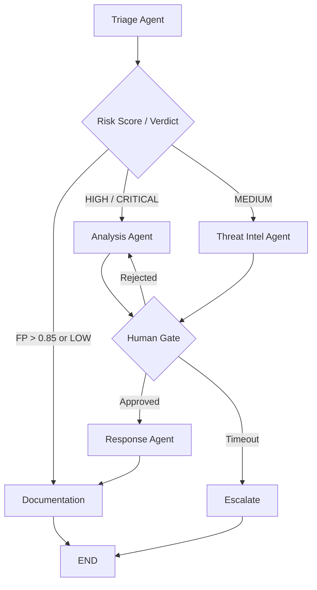
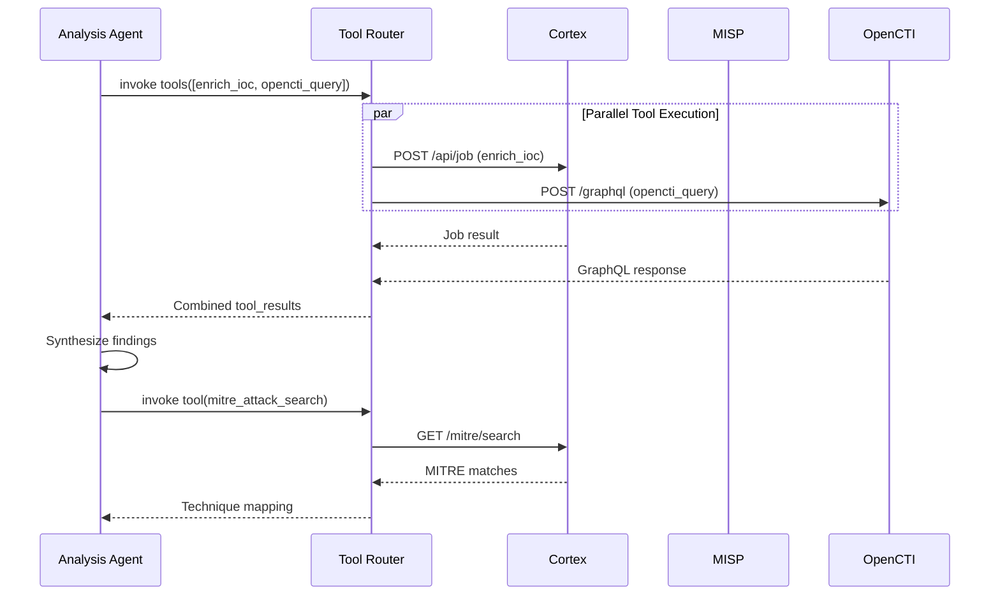
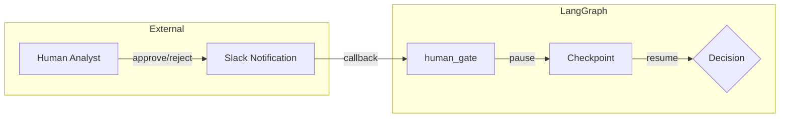
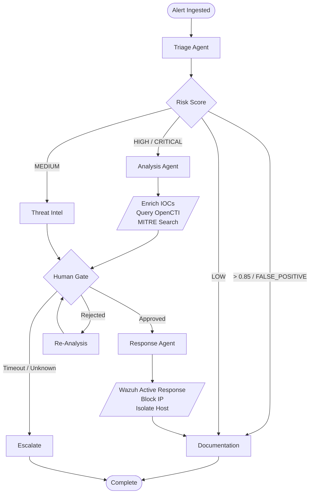

# LangGraph Framework Patterns

## State Graph Architecture

The Cobalto SOC agent is built on LangGraph's `StateGraph`, with `SOCAgentState` as the central data structure flowing through every node.

### SOCAgentState Definition

```python
from typing import Annotated, TypedDict, Literal
from langgraph.graph.message import add_messages
import operator

class SOCAgentState(TypedDict):
    alert_id: str
    alert_data: dict
    messages: Annotated[list, operator.add]
    risk_score: float
    verdict: str  # TRUE_POSITIVE, FALSE_POSITIVE, INCONCLUSIVE
    response_actions: list[dict]
    human_decision: str | None
    tool_results: Annotated[list, operator.add]
    current_phase: str
    error_log: Annotated[list, operator.add]
```

The `Annotated[list, operator.add]` pattern ensures append-only fields (`messages`, `tool_results`, `error_log`) accumulate across nodes without overwriting.

### State Mutation Per Node

| Node | Fields Mutated | Fields Read |
|------|---------------|-------------|
| `triage` | `risk_score`, `verdict`, `current_phase` | `alert_data` |
| `analysis` | `tool_results`, `messages`, `current_phase` | `alert_data`, `risk_score` |
| `threat_intel` | `tool_results`, `messages`, `current_phase` | `alert_data` |
| `response` | `response_actions`, `messages`, `current_phase` | `verdict`, `risk_score`, `tool_results` |
| `documentation` | `messages`, `current_phase` | `alert_data`, `verdict`, `risk_score`, `tool_results` |
| `escalate` | `messages`, `current_phase` | `alert_id`, `verdict`, `error_log` |
| `human_gate` | `human_decision`, `messages` | `alert_data`, `verdict`, `risk_score` |

---

## Node Design Patterns

### Agent Nodes

Each agent node is a LangGraph `@async_node` that reads from state, calls an LLM or tool, and returns state mutations.

```python
from langgraph.graph import StateGraph, START, END
from langgraph.prebuilt import ToolNode

async def triage_agent(state: SOCAgentState) -> dict:
    llm = get_llm(model="gpt-4o", temperature=0.1)
    structured_llm = llm.with_structured_output(TriageResult)

    prompt = f"""Analyze the following security alert and classify it.
    Alert: {json.dumps(state['alert_data'], indent=2)}

    Return:
    - risk_score (0.0-1.0)
    - verdict (TRUE_POSITIVE, FALSE_POSITIVE, INCONCLUSIVE)
    - reasoning"""

    result = await structured_llm.ainvoke([
        {"role": "system", "content": TRIAGE_SYSTEM_PROMPT},
        {"role": "user", "content": prompt}
    ])

    return {
        "risk_score": result.risk_score,
        "verdict": result.verdict,
        "current_phase": "triage_complete",
        "messages": [AIMessage(content=f"Triage complete: {result.verdict}")]
    }
```

### Agent Nodes in the Graph

| Node | Purpose | LLM Model | Temperature |
|------|---------|-----------|-------------|
| `triage` | Initial alert classification | gpt-4o | 0.1 |
| `analysis` | Deep investigation of suspicious alerts | claude-sonnet | 0.2 |
| `threat_intel` | IOC enrichment and correlation | gpt-4o-mini | 0.1 |
| `response` | Automated containment actions | gpt-4o | 0.0 |
| `documentation` | Case report generation | gpt-4o-mini | 0.3 |
| `escalate` | Human escalation with context | gpt-4o | 0.1 |

### Human Gate Node

```python
async def human_gate(state: SOCAgentState) -> dict:
    """Pauses execution and waits for human input via callback."""
    alert_summary = format_alert_for_human(state["alert_data"], state["verdict"])

    # Emit notification (Slack, email, etc.)
    await notify_soc_team(
        alert_id=state["alert_id"],
        summary=alert_summary,
        recommended_action=state.get("response_actions", []),
        risk_score=state["risk_score"]
    )

    # Register checkpoint for external callback
    await register_human_checkpoint(
        alert_id=state["alert_id"],
        timeout_seconds=3600
    )

    return {
        "current_phase": "awaiting_human",
        "messages": [AIMessage(content="Awaiting human approval")]
    }
```

---

## Routing Logic

### Post-Triage Routing

```python
def triage_router(state: SOCAgentState) -> str:
    verdict = state["verdict"]
    risk_score = state["risk_score"]

    if verdict == "FALSE_POSITIVE" or risk_score > 0.85:
        return "documentation"
    elif verdict in ("HIGH", "CRITICAL") or risk_score >= 0.7:
        return "analysis"
    elif verdict == "MEDIUM" or risk_score >= 0.4:
        return "threat_intel"
    else:  # LOW
        return "documentation"
```



### Post-Human-Gate Routing

```python
def human_gate_router(state: SOCAgentState) -> str:
    decision = state.get("human_decision")

    if decision == "approved":
        return "response"
    elif decision == "rejected":
        return "analysis"
    elif decision == "timeout":
        return "escalate"
    else:
        return "escalate"
```

---

## Tool Integration Pattern

### External Tool Definitions

```python
import httpx
from langchain_core.tools import tool

MISP_BASE_URL = os.getenv("MISP_URL")
CORTEX_BASE_URL = os.getenv("CORTEX_URL")
OPENCTI_BASE_URL = os.getenv("OPENCTI_URL")

@tool
async def mitre_attack_search(query: str) -> dict:
    """Search MITRE ATT&CK framework for tactics and techniques."""
    async with httpx.AsyncClient(timeout=10.0) as client:
        resp = await client.get(
            f"{CORTEX_BASE_URL}/mitre/search",
            params={"q": query},
            headers={"Authorization": f"Bearer {CORTEX_TOKEN}"}
        )
        resp.raise_for_status()
        return resp.json()

@tool
async def enrich_ioc(ioc_value: str, ioc_type: str) -> dict:
    """Enrich an IOC via Cortex analyzer (VirusTotal, AbuseIPDB)."""
    async with httpx.AsyncClient(timeout=15.0) as client:
        # Create job
        job = await client.post(
            f"{CORTEX_BASE_URL}/api/job",
            json={
                "data": ioc_value,
                "data-type": ioc_type,
                "analyzer": "VirusTotal_Get_Observable_3_1"
            },
            headers={"Authorization": f"Bearer {CORTEX_TOKEN}"}
        )
        job_id = job.json()["id"]

        # Poll for result
        for _ in range(30):
            await asyncio.sleep(2)
            result = await client.get(
                f"{CORTEX_BASE_URL}/api/job/{job_id}",
                headers={"Authorization": f"Bearer {CORTEX_TOKEN}"}
            )
            if result.json()["status"] in ("Success", "Failure"):
                return result.json()

        return {"status": "timeout"}

@tool
async def opencti_query(indicator: str) -> dict:
    """Query OpenCTI for indicator context and relationships."""
    query = """
    query IndicatorSearch($value: String!) {
        indicator(value: $value) {
            id
            name
            pattern
            valid_from
            objectLabel { name }
            observables { id observable_value }
            reports(first: 5) { edges { node { name description } } }
        }
    }
    """
    async with httpx.AsyncClient(timeout=10.0) as client:
        resp = await client.post(
            f"{OPENCTI_BASE_URL}/graphql",
            json={"query": query, "variables": {"value": indicator}},
            headers={"Authorization": f"Bearer {OPENCTI_TOKEN}"}
        )
        resp.raise_for_status()
        return resp.json()["data"]
```

### Tool Call Flow



---

## Checkpointing

### MemorySaver for State Persistence

```python
from langgraph.checkpoint.memory import MemorySaver

checkpointer = MemorySaver()

graph = StateGraph(SOCAgentState)
# ... add nodes and edges ...
compiled_graph = graph.compile(checkpointer=checkpointer)

# Invocation with thread
config = {"configurable": {"thread_id": alert_id}}
result = await compiled_graph.ainvoke(initial_state, config=config)

# Resume after human gate
resume_state = {"human_decision": "approved"}
result = await compiled_graph.ainvoke(resume_state, config=config)
```

### Conversation History Pattern

The `messages` field uses `Annotated[list, operator.add]` so each node appends without losing prior messages:

```python
# Triage node appends
return {"messages": [AIMessage(content="Triage verdict: TRUE_POSITIVE")]}

# Analysis node appends (doesn't overwrite triage message)
return {"messages": [AIMessage(content="Deep analysis findings...")]}

# Full history preserved in state["messages"]
```

---

## Human-in-the-Loop

### Execution Pause and Resume

```python
# Build graph with interrupt before human_gate
graph = StateGraph(SOCAgentState)
graph.add_node("triage", triage_agent)
graph.add_node("analysis", analysis_agent)
graph.add_node("threat_intel", threat_intel_agent)
graph.add_node("human_gate", human_gate)
graph.add_node("response", response_agent)
graph.add_node("documentation", documentation_agent)
graph.add_node("escalate", escalate_agent)

graph.add_conditional_edges("triage", triage_router)
graph.add_conditional_edges("human_gate", human_gate_router)

compiled = graph.compile(
    checkpointer=MemorySaver(),
    interrupt_before=["human_gate"]
)

# External callback resumes execution
async def on_human_decision(alert_id: str, decision: str):
    config = {"configurable": {"thread_id": alert_id}}
    await compiled.ainvoke(
        {"human_decision": decision},
        config=config
    )
```

### Approval Flow



---

## Error Handling

### Graceful Degradation

```python
async def analysis_agent(state: SOCAgentState) -> dict:
    errors = []

    # Attempt MISP enrichment
    try:
        misp_results = await enrich_ioc(ioc_value, ioc_type)
    except httpx.HTTPStatusError as e:
        errors.append({"tool": "enrich_ioc", "error": str(e)})
        misp_results = {"status": "degraded", "note": "MISP unavailable"}

    # Attempt OpenCTI query
    try:
        opencti_data = await opencti_query(indicator)
    except httpx.TimeoutException:
        errors.append({"tool": "opencti_query", "error": "timeout"})
        opencti_data = {"status": "degraded", "note": "OpenCTI timeout"}

    return {
        "tool_results": [{"misp": misp_results, "opencti": opencti_data}],
        "error_log": errors,
        "messages": [AIMessage(content=build_analysis_summary(misp_results, opencti_data))],
        "current_phase": "analysis_complete"
    }
```

### Fallback Paths

```python
def analysis_router(state: SOCAgentState) -> str:
    # If critical errors accumulated, escalate instead of continuing
    critical_errors = [e for e in state.get("error_log", []) if e.get("critical")]
    if len(critical_errors) >= 3:
        return "escalate"
    return "human_gate"
```

---

## Performance

### Async Execution

All nodes are async, enabling concurrent tool calls:

```python
async def analysis_agent(state: SOCAgentState) -> dict:
    # Parallel tool execution
    results = await asyncio.gather(
        enrich_ioc(ioc_value, "ip"),
        opencti_query(indicator),
        mitre_attack_search(technique),
        return_exceptions=True
    )
    # Handle partial failures gracefully
```

### Token Budget Management

```python
MAX_CONTEXT_TOKENS = 12000

def truncate_messages(messages: list, max_tokens: int) -> list:
    """Keep system prompt + recent messages within budget."""
    truncated = []
    token_count = 0
    for msg in reversed(messages):
        msg_tokens = estimate_tokens(msg.content)
        if token_count + msg_tokens > max_tokens:
            break
        truncated.insert(0, msg)
        token_count += msg_tokens
    return truncated
```

---

## Complete Agent Workflow



### Complete Graph Construction

```python
def build_soc_agent() -> CompiledGraph:
    graph = StateGraph(SOCAgentState)

    graph.add_node("triage", triage_agent)
    graph.add_node("analysis", analysis_agent)
    graph.add_node("threat_intel", threat_intel_agent)
    graph.add_node("response", response_agent)
    graph.add_node("documentation", documentation_agent)
    graph.add_node("escalate", escalate_agent)
    graph.add_node("human_gate", human_gate)

    graph.add_edge(START, "triage")
    graph.add_conditional_edges("triage", triage_router, {
        "documentation": "documentation",
        "analysis": "analysis",
        "threat_intel": "threat_intel"
    })
    graph.add_conditional_edges("analysis", lambda s: "human_gate")
    graph.add_conditional_edges("threat_intel", lambda s: "human_gate")
    graph.add_conditional_edges("human_gate", human_gate_router, {
        "response": "response",
        "analysis": "analysis",
        "escalate": "escalate"
    })
    graph.add_edge("response", "documentation")
    graph.add_edge("documentation", END)
    graph.add_edge("escalate", END)

    return graph.compile(
        checkpointer=MemorySaver(),
        interrupt_before=["human_gate"]
    )
```
