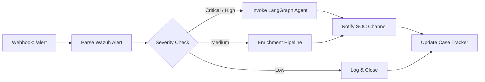
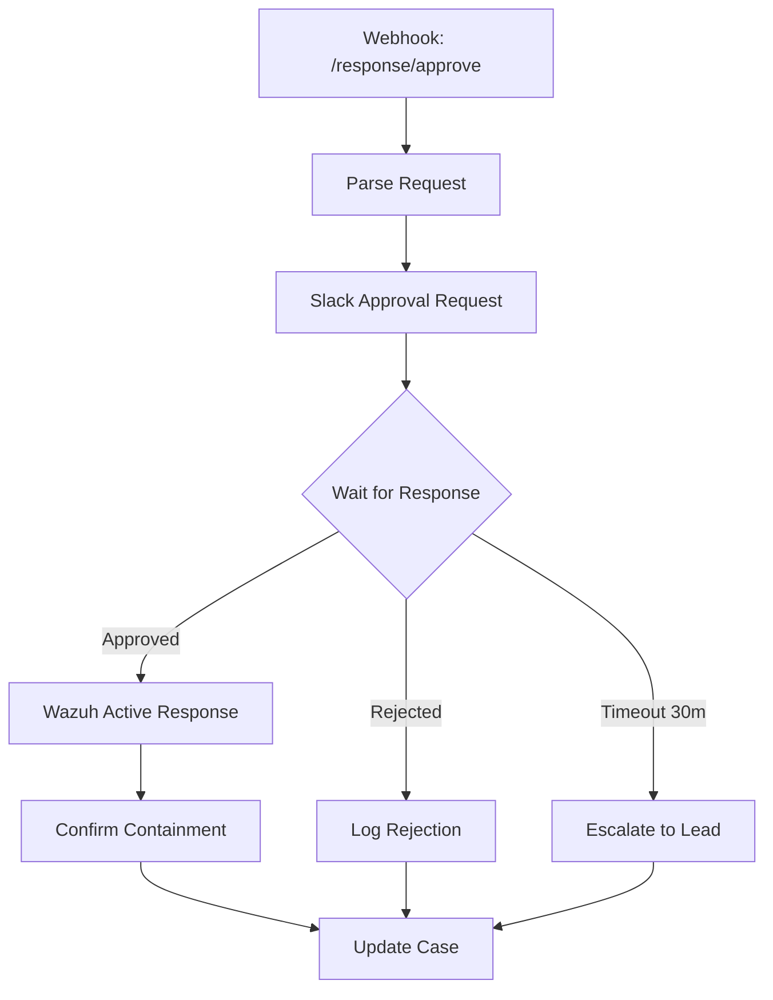
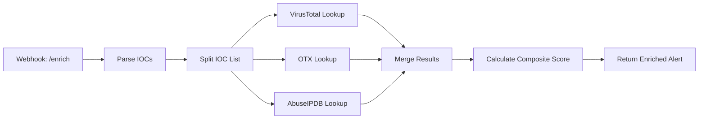
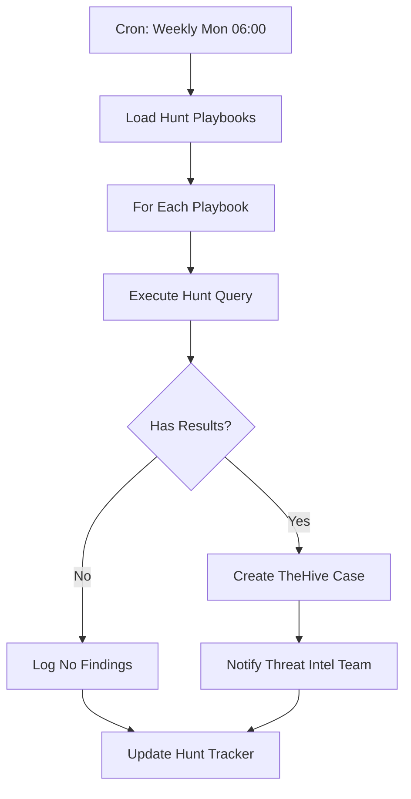
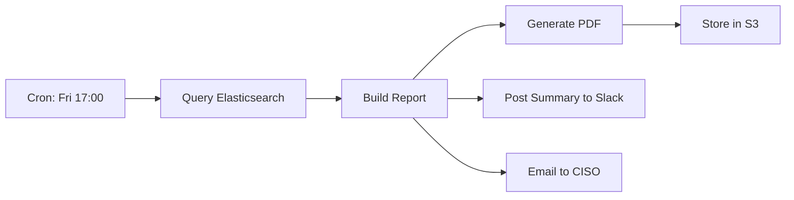
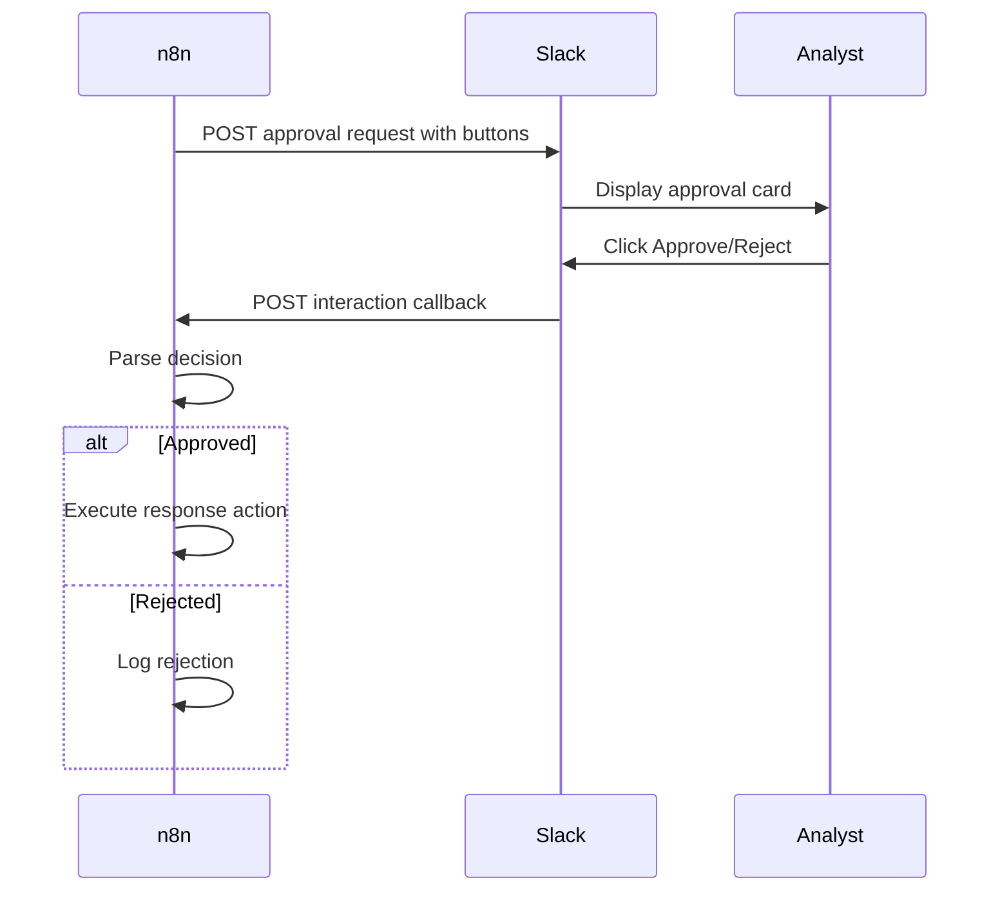
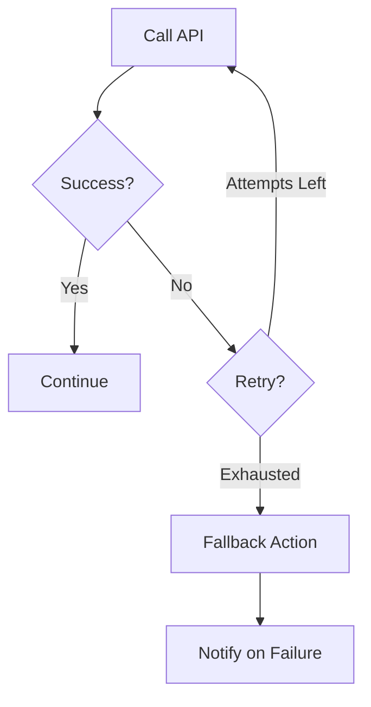

# n8n Workflow Framework

## Workflow Architecture

All Cobalto n8n workflows follow a five-stage pipeline pattern:

```
Trigger → Parse → Route → Execute → Track
```

| Stage | Purpose | Node Types |
|-------|---------|------------|
| Trigger | Receive external event or schedule | Webhook, Cron, Manual |
| Parse | Normalize incoming data | Function, Set, JSON |
| Route | Determine workflow path | IF, Switch, Merge |
| Execute | Perform action or call API | HTTP Request, Slack, Function |
| Track | Log outcome and update state | Set, Function, Webhook |

---

## Workflow Types

### 1. Alert Routing Workflow

Routes incoming Wazuh alerts to the appropriate processing pipeline based on severity and rule group.



#### Workflow JSON Structure

```json
{
  "name": "Alert Routing",
  "nodes": [
    {
      "parameters": {
        "path": "alert",
        "responseMode": "responseNode",
        "options": {}
      },
      "name": "Webhook",
      "type": "n8n-nodes-base.webhook",
      "typeVersion": 2,
      "position": [240, 300],
      "webhookId": "cobalto-alerts"
    },
    {
      "parameters": {
        "jsCode": "const alert = $input.first().json.body;\nconst severity = alert.rule.level || 0;\nconst ruleGroup = alert.rule.groups || [];\nreturn [{ json: { ...alert, parsedSeverity: severity, parsedGroups: ruleGroup } }];"
      },
      "name": "Parse Alert",
      "type": "n8n-nodes-base.code",
      "typeVersion": 2,
      "position": [460, 300]
    },
    {
      "parameters": {
        "rules": {
          "values": [
            {
              "conditions": {
                "number": [{ "value1": "={{$json.parsedSeverity}}", "operation": "gte", "value2": 12 }]
              },
              "output": 0
            },
            {
              "conditions": {
                "number": [{ "value1": "={{$json.parsedSeverity}}", "operation": "gte", "value2": 7 }]
              },
              "output": 1
            }
          ]
        }
      },
      "name": "Severity Router",
      "type": "n8n-nodes-base.switch",
      "typeVersion": 3,
      "position": [680, 300]
    },
    {
      "parameters": {
        "url": "http://langgraph-api:8000/agent/run",
        "method": "POST",
        "sendBody": true,
        "bodyParameters": {
          "parameters": [
            { "name": "alert_id", "value": "={{$json.id}}" },
            { "name": "alert_data", "value": "={{JSON.stringify($json)}}"}
          ]
        }
      },
      "name": "Invoke Agent",
      "type": "n8n-nodes-base.httpRequest",
      "typeVersion": 4.2,
      "position": [920, 200]
    },
    {
      "parameters": {
        "channel": "#soc-alerts",
        "text": "🔴 *Critical Alert*: {{$json.alert_id}}\nRule: {{$json.rule.description}}\nAgent verdict: {{$json.verdict}}"
      },
      "name": "Slack Notify",
      "type": "n8n-nodes-base.slack",
      "typeVersion": 2.2,
      "position": [1140, 200]
    }
  ],
  "connections": {
    "Webhook": { "main": [[{ "node": "Parse Alert", "type": "main", "index": 0 }]] },
    "Parse Alert": { "main": [[{ "node": "Severity Router", "type": "main", "index": 0 }]] },
    "Severity Router": {
      "main": [
        [{ "node": "Invoke Agent", "type": "main", "index": 0 }],
        [{ "node": "Invoke Agent", "type": "main", "index": 0 }]
      ]
    },
    "Invoke Agent": { "main": [[{ "node": "Slack Notify", "type": "main", "index": 0 }]] }
  }
}
```

---

### 2. Response Approval Workflow

Implements human-in-the-loop approval for automated containment actions.



#### Approval Notification Template

```json
{
  "channel": "#soc-approvals",
  "blocks": [
    {
      "type": "header",
      "text": { "type": "plain_text", "text": "Response Approval Required" }
    },
    {
      "type": "section",
      "fields": [
        { "type": "mrkdwn", "text": "*Alert ID:*\n{{$json.alert_id}}" },
        { "type": "mrkdwn", "text": "*Risk Score:*\n{{$json.risk_score}}" },
        { "type": "mrkdwn", "text": "*Recommended Action:*\n{{$json.action}}" },
        { "type": "mrkdwn", "text": "*Target:*\n{{$json.target_host}}" }
      ]
    },
    {
      "type": "actions",
      "elements": [
        {
          "type": "button",
          "text": { "type": "plain_text", "text": "Approve" },
          "style": "primary",
          "value": "approved",
          "action_id": "approve_response"
        },
        {
          "type": "button",
          "text": { "type": "plain_text", "text": "Reject" },
          "style": "danger",
          "value": "rejected",
          "action_id": "reject_response"
        }
      ]
    }
  ]
}
```

---

### 3. Enrichment Pipeline

Enriches IOCs from incoming alerts using external threat intelligence sources.



#### Enrichment Node Configuration

```json
{
  "name": "VirusTotal Enrichment",
  "type": "n8n-nodes-base.httpRequest",
  "typeVersion": 4.2,
  "parameters": {
    "url": "=https://www.virustotal.com/api/v3/ip_addresses/{{$json.ioc_value}}",
    "method": "GET",
    "authentication": "genericCredentialType",
    "genericAuthType": "httpHeaderAuth",
    "credentials": {
      "httpHeaderAuth": { "id": "vt-api-key", "name": "VirusTotal API Key" }
    },
    "options": { "timeout": 15000 }
  }
}
```

---

### 4. Hunt Scheduling Workflow

Periodically triggers threat hunting jobs and tracks results.



#### Cron Configuration

```json
{
  "parameters": {
    "rule": {
      "interval": [
        { "field": "cronExpression", "expression": "0 6 * * 1" }
      ]
    }
  },
  "name": "Weekly Hunt Trigger",
  "type": "n8n-nodes-base.scheduleTrigger",
  "typeVersion": 1.2,
  "position": [240, 300]
}
```

---

### 5. Weekly Reporting Workflow

Aggregates weekly SOC metrics and distributes reports.



---

## Integration Patterns

### Wazuh Webhook → n8n

```yaml
# wazuh /etc/ossec.conf
<ossec_config>
  <global>
    <email_notification>yes</email_notification>
  </global>
  <integration>
    <name>custom-n8n</name>
    <hook_url>http://n8n-host:5678/webhook/wazuh-alerts</hook_url>
    <alert_format>json</alert_format>
    <level>7</level>
  </integration>
</ossec_config>
```

### n8n → LangGraph API

```json
{
  "url": "http://langgraph-api:8000/agent/run",
  "method": "POST",
  "headers": {
    "Content-Type": "application/json",
    "X-Api-Key": "={{$credentials.langgraphApiKey}}"
  },
  "sendBody": true,
  "specifyBody": "json",
  "jsonBody": "={{ JSON.stringify({ alert_id: $json.id, alert_data: $json }) }}"
}
```

### n8n → TheHive

```json
{
  "url": "http://thehive:9000/api/case",
  "method": "POST",
  "headers": {
    "X-Api-Key": "={{$credentials.theHiveApiKey}}",
    "Content-Type": "application/json"
  },
  "sendBody": true,
  "jsonBody": "={{ JSON.stringify({ title: 'Alert ' + $json.alert_id, description: $json.summary, severity: $json.severity, flag: false }) }}"
}
```

### n8n → Wazuh Active Response

```json
{
  "url": "http://wazuh:55000/agent/$json.agent_id/command",
  "method": "PUT",
  "headers": {
    "Authorization": "Basic ={{$credentials.wazuhBasicAuth}}"
  },
  "sendBody": true,
  "jsonBody": "={{ JSON.stringify({ command: 'firewall-drop', args: ['-1', $json.attacker_ip] }) }}"
}
```

---

## Human Approval Pattern

### Slack Interactive Callback → n8n



### Callback Handling

```json
{
  "parameters": {
    "path": "slack-interaction",
    "responseMode": "responseNode",
    "options": {}
  },
  "name": "Slack Callback Receiver",
  "type": "n8n-nodes-base.webhook",
  "typeVersion": 2,
  "position": [240, 300]
}
```

---

## Error Handling

### Retry Logic

```json
{
  "parameters": {
    "url": "http://langgraph-api:8000/agent/run",
    "retry": {
      "maxTries": 3,
      "waitBetweenTries": 5000,
      "retryOn": [500, 502, 503, 504]
    }
  }
}
```

### Timeout Handling

```json
{
  "parameters": {
    "options": {
      "timeout": 30000,
      "redirect": { "followRedirects": false }
    }
  }
}
```

### Fallback Paths



---

## Credential Management

### n8n Credential Store

| Credential Name | Type | Purpose |
|----------------|------|---------|
| `langgraphApiKey` | Header Auth | LangGraph API authentication |
| `theHiveApiKey` | Header Auth | TheHive case management |
| `wazuhBasicAuth` | Basic Auth | Wazuh API access |
| `vt-api-key` | Header Auth | VirusTotal API |
| `slackBotToken` | Header Auth | Slack notifications |
| `openctiToken` | Header Auth | OpenCTI GraphQL API |
| `cortexToken` | Header Auth | Cortex analyzer access |

### Environment Variables

```env
N8N_BASIC_AUTH_USER=admin
N8N_BASIC_AUTH_PASSWORD=${N8N_PASSWORD}
N8N_ENCRYPTION_KEY=${N8N_KEY}
WEBHOOK_URL=https://n8n.cobalto.internal/
N8N_HOST=n8n.cobalto.internal
N8N_PORT=5678
N8N_PROTOCOL=https
```

---

## Complete Workflow Inventory

| Workflow | Trigger | SLA |
|----------|---------|-----|
| Alert Routing | Wazuh webhook | < 5 min to agent |
| Response Approval | LangGraph callback | 30 min timeout |
| Enrichment Pipeline | Alert routing downstream | < 2 min per IOC |
| Hunt Scheduling | Weekly cron | Mon 06:00 UTC |
| Weekly Reporting | Weekly cron | Fri 17:00 UTC |
| Incident Escalation | LangGraph callback | Immediate |
| IOC Feeds Sync | 6-hour cron | < 15 min |
